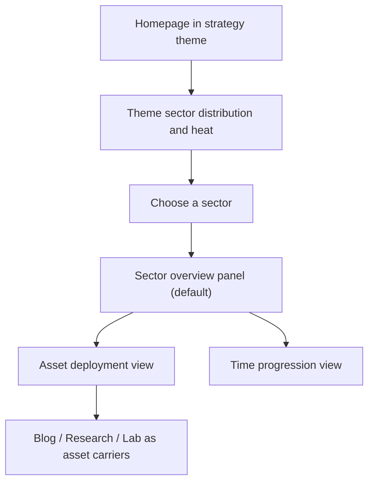

# Strategy Interface Theme

## Problem Frame

当前站点已经完成 Astro 重建，并建立了博客、研究、实验三条内容线，但整体体验仍然主要像一个内容站。此前的策略主题方向偏向“档案库科技系统”，这让页面更统一，却仍然离“像一个游戏”很远。

用户现在明确希望把策略主题重定向为一种更重度的策略游戏式指挥界面。目标不再是“给内容站加一点仪式感”，而是把整站重构成一个内容资产指挥中心：用户进入后，首先看到的不是频道入口，而是主题战区的分布与热度，再基于战区态势去调度博客、研究和实验这些资产载体。

这意味着后续工作不能只继续调整颜色、边框和卡片语言，而需要把交互层、信息架构优先级和主题内的默认视角一起重写。

## Requirements

**Theme Model**
- R1. 站点应保留当前默认主题，并新增一个可切换的“策略界面主题”，而不是直接替换现有视觉语言。
- R2. 主题切换入口应放在全站导航中，但保持低调，不应喧宾夺主或让普通访客误以为站点存在多个完全独立版本。
- R3. 站点应记住用户上一次选择的主题，使访客下次访问时继续使用之前的主题模式。

**Strategy Interface Direction**
- R4. 策略界面主题应明确采用“重度策略指挥界面”方向，而不是档案库轻主题、模拟经营界面或成长闯关界面。
- R5. 策略主题的核心对象应是“内容资产”，博客、研究和实验是资产载体，而不是首页主角。
- R6. 策略主题的核心价值应落在交互与信息调度层；用户切换到该主题后，应明显感受到自己在查看和调度战区、资产与活跃信号，而不是只在浏览一套换肤后的页面。

**Homepage and Global Flow**
- R7. 首页在策略主题下应首先呈现“主题战区分布与热度”，而不是先呈现博客、研究、实验三个频道入口。
- R8. 首页的首要任务应是帮助用户判断当前哪些主题战区更活跃、更重要，以及注意力主要投向了哪里。
- R9. 首页中博客、研究和实验的角色应降级为资产来源和部署渠道，用于解释某个战区下有哪些可进入的单位，而不是作为顶层导航心智。
- R10. 首页的整体底盘应更接近“作战系统面板”，而不是地图式战区页或频道卡片墙。
- R11. 首页的第一视觉焦点应是“主题节点网络”，而不是热度表格、统计图表或频道入口卡组。
- R12. 主题节点网络中的节点代表主题战区，连线的主语义应是主题相关性，而不是阅读路径或科技树式推进关系。
- R13. 节点之间的相关性应优先由现有内容中的共现、共享标签、共享主题或相近研究焦点来支撑，而不是依赖难以验证的伪行为关系。
- R14. 热度应通过节点强弱、辉光或连接活跃度被感知，但这些表现不应改变连线的主语义。
- R15. 首页节点网络不应把所有主题平权平铺，而应采用“主战区 + 次级散点”的版图结构。
- R16. 主战区应占据网络中心或主要视觉层级，次级散点应作为外围主题存在，用于保留版图完整感而不稀释主叙事。
- R17. 主战区的选择应采用“半动态”规则：少量核心战区固定存在，其余中心位可根据热度轮换。
- R18. 半动态规则中的固定核心战区应由人工指定，而不是完全交给系统自动推导。
- R19. 除固定核心战区之外，其余中心位应由规则补位，使首页态势图能随内容热度变化而更新。
- R20. 首页主题网络中的固定核心战区数量应为 3 个，以保证中心区既有稳定身份，又能容纳足够清晰的长期主线。
- R21. 当前固定核心战区应命名为“AI 工具侦察”“自研项目推进”和“AI 认知校准”，用于承载站点的长期中心身份。
- R22. 三个固定核心战区不应完全平级，其中“自研项目推进”应作为总主战区，“AI 工具侦察”和“AI 认知校准”分别承担支援与校准角色。

**Theme Sector Experience**
- R23. 用户在首页点击一个主题节点后，默认第一反应不应是立刻整页跳转，而应先进入网络聚焦模式。
- R24. 网络聚焦模式下，应高亮当前主题节点及其关联节点和连线，帮助用户先理解战区关系，而不是立刻丢失全局态势。
- R25. 节点被聚焦时，应同时展开一个不抢主画面的战区情报面板，用于展示该主题的总览摘要、代表资产、热度状态和进入战区的明确动作。
- R26. 用户从首页进入某个主题战区后，默认首屏应是“战区总览面板”，而不是直接进入文章列表或时间线。
- R27. 战区总览面板应优先呈现该主题的热度、当前主子主题、代表资产和活跃信号，帮助用户先判断战区状态，再决定往下钻。
- R28. 每个主题战区应提供至少两个次级视角：一个用于查看资产部署，一个用于查看时间推进。
- R29. “资产部署”视角应把博客、研究和实验条目视为同一战区下的不同资产单位，而不是彼此独立的频道内容。
- R30. “时间推进”视角应帮助用户理解某个主题战区的升温、停滞或扩张，而不是只罗列最近更新。

**Coverage and Clarity**
- R31. 策略界面主题应覆盖整站，使访客在任意页面切换后都能保持统一的策略指挥界面语义，而不是只有首页和研究页像游戏，其余页面仍像传统内容站。
- R32. 即使策略主题明显更重度，站点的信息层级、导航清晰度和内容可读性也不应被破坏。

**Map Battlefield Expression**
- R33. 首页战区版图应进一步升级为真正的“地图式战区界面”，而不是停留在抽象沙盘或示意性网络布局。
- R34. 不同战区在首页版图中应拥有明确且可感知的坐标位置，使用户能够通过空间分布理解战区关系，而不是只通过列表或均质卡片理解它们。
- R35. 战区节点的颜色应直接响应当前热度，让用户在第一眼就能通过颜色区分冷、温、热战区，而不是只依赖文案或数字判断。
- R36. 固定核心战区的地图坐标应保持稳定，以维持用户的空间记忆；动态补位战区和外围散点只能在预设区域内变化，而不应每次完全漂移。

## Success Criteria

- 访客可以通过导航中的低调入口在默认主题和策略界面主题之间切换。
- 返回站点后，用户仍能看到上次选择的主题。
- 首页在策略主题下首先呈现以主题节点网络为主角的主题战区分布与热度，而不是频道优先的内容入口。
- 首页网络以主战区为核心，同时保留次级散点，且中心结构会以半动态方式变化。
- 首页网络中的固定核心战区由人工指定，其余中心位按规则补位轮换。
- 固定核心战区数量为 3 个：这样首页中心区既能容纳长期核心主线，也能保留一个动态补位位点。
- 当前固定核心战区名称为“AI 工具侦察”“自研项目推进”和“AI 认知校准”。
- 当前固定核心战区中，“自研项目推进”是总主战区，“AI 工具侦察”和“AI 认知校准”承担支援与校准角色。
- 用户点击首页主题节点后，会先看到网络聚焦与战区情报面板，而不是被立即整页带走。
- 用户进入任一主题战区后，默认看到的是战区总览面板，并能继续切换到资产部署和时间推进视角。
- 博客、研究和实验在策略主题下被理解为资产单位与载体，而不是首页主叙事。
- 即使主题更像游戏，用户仍然可以顺畅进入具体内容并完成阅读。
- 首页战区图会被感知为一张真正的地图式战区版图，而不是普通节点图。
- 不同战区在首页上拥有稳定可辨的空间坐标，固定核心战区不会随意换位。
- 用户可以通过节点颜色快速判断战区热度，而不需要先阅读指标文案。

## Scope Boundaries

- 不移除或弱化默认主题。
- 不把站点做成模拟经营系统、成长解锁系统或任务成就系统。
- 不引入积分、等级、奖励、角色养成或数值化进度条作为主体验。
- 不以模仿某个具体商业游戏 UI 为目标。
- 不为了游戏感牺牲正文阅读和基础导航。

## Key Decisions

- 保留默认主题并新增第二主题：这样既能保住当前站点的稳定入口，也能给重度策略界面提供明确边界。
- 从“档案库科技系统”转向“重度策略指挥界面”：这是一次方向修正，而不是单纯视觉强化。
- 以主题战区而不是频道作为首页主角：因为用户明确希望先看主题分布和热度，而不是先看博客、研究、实验这些表现形式。
- 把博客、研究和实验定义为资产载体：这样整站可以围绕主题战区统一组织，而不是继续沿频道心智展开。
- 首页主界面采用“作战系统面板 + 主题节点网络”：这样首页的第一感受更接近策略游戏总控 HUD，而不是内容站或地图页。
- 首页节点网络的连线主语义采用“主题相关性”：因为这在当前数据基础上最容易落地、解释成本最低，同时最适合承担“先看全局态势”的任务。
- 首页网络采用“主战区 + 次级散点 + 半动态中心位”：这样既能保住站点的核心身份，又能让态势图真的表现出变化，而不是静态装饰。
- 首页战区图需要进一步转向“地图式坐标布局”而不是抽象示意图：因为用户现在明确要求不同战区具有真实坐标感和地图感，这会让首页更接近真正的策略游戏战区版图。
- 固定核心战区坐标应稳定，动态战区使用预设补位区：这样既能保持地图的空间记忆，又能允许热度驱动的局部变化。
- 节点颜色直接映射战区热度：这样热度会成为地图的一部分，而不是漂浮在节点外的附加说明。
- 半动态结构采用“人工指定核心战区 + 规则补位”：这样既保住站点的长期身份，又避免首页完全静态。
- 当前三条固定核心战区分别命名为“AI 工具侦察”“自研项目推进”和“AI 认知校准”：这样既保留你的原始意图，也更像策略界面的战区命名。
- `自研项目推进` 作为总主战区：因为它最适合承接工具侦察与认知校准带来的输入，并成为首页中心区的主锚点。
- 点击节点先进入“网络聚焦 + 右侧情报面板”，再由用户明确决定是否进入战区：这样能保住全局态势，同时强化“选中战区再读取情报”的游戏节奏。
- 主题战区详情默认首屏采用“战区总览面板”：这样最符合“先看态势，再调度资产，再回看推进”的策略游戏节奏。

## Dependencies / Assumptions

- 当前站点已有可切换主题状态、共享布局入口和部分策略主题基础，这些可以作为重做信息架构与交互层的承载基础。
- 当前内容 schema 中已经具备分类、标签、研究条目和实验条目等资产来源，但“主题热度”与“战区分布”的表达方式仍需在后续计划阶段具体定义。

## Alternatives Considered

- 保持“档案库科技系统”方向，仅继续强化视觉：被拒绝，因为用户明确认为当前结果离“像个游戏”仍然太远。
- 以博客、研究、实验三频道作为首页主轴，再增加一些游戏化样式：被拒绝，因为用户明确认为频道只是表现形式，真正要看的仍然是主题分布和热度。
- 直接把主题战区详情做成资产清单或时间线：未选为默认首屏，因为它们都不足以承担“先看战区态势”的主任务。
- 点击首页节点后立刻整页跳入战区详情：未选为默认反应，因为这样会过早打断首页最重要的全局态势感。
- 让连线主语义直接承担“阅读路径”或“研究推进关系”：未选为第一版主关系，因为它们都比“主题相关性”更难维护、解释成本更高，也更容易显得像伪数据。
- 首页只展示固定主战区，或把全部主题平铺进网络：未选为第一版主结构，因为前者太静，后者太散，而“主战区 + 次级散点 + 半动态”更平衡。
- 让系统完全自动决定哪些主题是核心战区：未选为默认机制，因为这会削弱站点身份稳定性，也会让首页心智过度波动。
- 固定核心战区数量仍停留在 2 个：未选为当前默认，因为它不足以同时承载工具跟进、自研推进和认知更新这三条长期主线。
- 使用更偏栏目化或说明式的固定核心名称：未选为当前默认，因为它们比“AI 工具侦察 / 自研项目推进”更不像策略界面的战区命名。
- 三个固定核心战区完全平级：未选为当前默认，因为这会削弱首页中心区的主锚点与指挥层级。

## Outstanding Questions

### Resolve Before Planning
- None.

### Deferred to Planning
- [Affects R11, R15, R16, R17, R20, R23][Needs research] 首页主题节点网络最合适的视觉结构是什么，才能既像策略游戏主界面又不会立刻退化成普通图表页？
- [Affects R25, R26, R28, R29][Technical] 主题战区详情页应采用何种页面结构，才能让“总览 / 资产部署 / 时间推进”三视角既清晰又具有指挥界面感？
- [Affects R5, R29, R31][Technical] 博客、研究和实验这些现有路由如何在策略主题下被重释为资产单位，同时不破坏现有可访问路由与内容来源模型？
- [Affects R8, R14, R17, R19, R27, R30][Needs research] “战区热度”“活跃信号”“时间推进”各自应由哪些内容信号驱动，才能让它们看起来像真实态势而不是装饰性指标？
- [Affects R33, R34, R35, R36][Needs research] 首页地图式战区版图应采用什么坐标系统与视觉底图，才能既像真正地图，又不把实现复杂度推到不可维护的程度？

## Visual Aid

## Next Steps

-> /ce:plan for structured implementation planning
