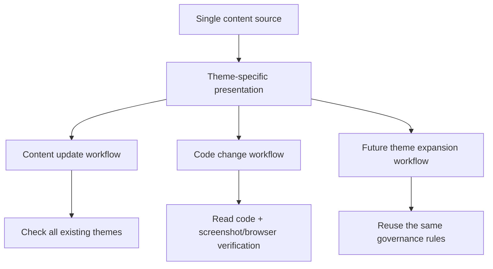

# Theme Maintenance Governance

## Problem Frame

站点已经从单一主题演进为多主题系统，并且未来很可能继续增加新的主题。如果没有一套统一维护标准，内容更新和代码变更很容易只在一个主题里成立，而在另一个主题里出现结构失真、语义不通或显示缺失。

当前最需要解决的问题不是继续做某个新页面，而是建立一套长期可执行的维护治理规则：无论是新增文章、研究、实验内容，还是修改布局、组件、样式和交互逻辑，都能稳定保证所有现有主题正确显示，并且未来新增主题时也能复用同一套规则，而不是重新发明流程。

这套治理规则应作为你自己日常维护的操作手册，同时也能让未来协作者在不了解历史上下文的情况下，按照同一标准工作。

## Requirements

**Content Source Rules**
- R1. 站点应坚持单一内容源原则：同一篇文章、研究条目或实验条目只维护一份内容事实，而不是为不同主题维护多份内容版本。
- R2. 不同主题可以改变视觉、结构和交互，但不应改变内容事实本身。
- R3. 所有主题共享同一份内容来源时，主题差异应通过页面组织、信息层级、组件选择和交互流程来实现，而不是通过复制内容实现。

**Change Governance**
- R4. 内容更新和代码变更都必须进行多主题检查，而不是只在默认主题或当前正在开发的主题下验证。
- R5. 代码变更是这套治理规则的第一优先风险场景，规范应优先防止页面、组件、样式或主题逻辑改动导致某个主题悄悄失真。
- R6. 内容更新应有比代码变更更轻量但仍明确的多主题检查流程，确保新增或修改内容时所有现有主题都能正确显示。
- R7. 未来新增主题时，必须复用同一套治理规则，而不是为新主题单独发明一套维护方式。

**Validation Rules**
- R8. 代码变更的最低验收标准应包含：阅读受影响代码，并通过浏览器结果或截图验证相关页面在所有现有主题下都能正确显示。
- R9. 内容更新的最低验收标准应包含：检查该内容在所有现有主题下都能正确显示，而不是只抽查一个主题。
- R10. 多主题验证应优先依赖真实页面结果，而不是只依赖静态阅读或主观判断。
- R11. 现有浏览器级主题验证能力应被视为治理规则的一部分，而不是可有可无的附加步骤。

**Governance Strength**
- R12. 这套规范应采用“半强制”模式：默认必须遵守，但在极少数场景下允许人工说明跳过原因。
- R13. 规范应优先形成统一验收清单和标准流程，而不是只停留在建议或最佳实践层。

**Audience and Documentation**
- R14. 这套治理文档应同时服务你自己和未来协作者。
- R15. 文档内容应足够明确，使协作者无需依赖隐性历史知识也能执行多主题维护。
- R16. 文档应覆盖至少三类场景：内容更新、代码变更、主题扩展。

## Success Criteria

- 以后新增或修改内容时，有一套明确流程保证所有现有主题都能正确显示。
- 以后修改页面、组件、样式或主题逻辑时，有一套明确流程保证不会只修好一个主题。
- 未来如果新增第三、第四个主题，不需要重新设计维护机制，而是沿用同一套规则扩展。
- 这份文档既能作为你自己的维护手册，也能作为未来协作者的入门和验收标准。

## Scope Boundaries

- 不为不同主题维护多份内容事实。
- 不要求所有主题视觉、结构和交互完全相同。
- 不把治理规则做成完全强制、无法例外的硬约束系统。
- 不把这份文档写成纯测试实现方案或纯工程设计文档。

## Key Decisions

- 采用单一内容源：这样能避免多主题系统最常见的内容漂移问题。
- 允许视觉、结构和交互差异：因为当前策略主题已经明显不只是视觉换肤，未来新增主题也不应被限制成纯样式层主题。
- 内容更新和代码变更都纳入多主题检查：这样治理规则既覆盖静态内容，也覆盖最容易引发主题回归的代码层改动。
- 代码变更作为第一优先风险：因为它最容易一次性破坏多个主题。
- 治理强度采用半强制：这样既能形成稳定规则，又保留少量现实操作弹性。
- 新增主题必须复用现有治理规则：这样未来主题扩展不会把维护成本推向失控。

## Dependencies / Assumptions

- 站点当前已经有至少两个主题，并且通过根级主题状态进行切换。
- 当前仓库已经具备浏览器级主题验证起点，例如 `tests/e2e/theme.spec.ts`。
- 未来新增主题时，仍会延续“单一内容源，多主题呈现”的总体架构。

## Alternatives Considered

- 只做双主题约定，不考虑未来新增主题：被拒绝，因为用户明确希望后续新增主题时也能尽量规范。
- 为不同主题允许主题专属内容分支：被拒绝，因为这会快速引发内容事实漂移。
- 只在代码变更时检查多主题，内容更新不检查：被拒绝，因为内容本身同样会暴露主题结构问题。
- 只保留建议型最佳实践：被拒绝，因为这不足以形成可执行的长期维护流程。

## Outstanding Questions

### Resolve Before Planning
- None.

### Deferred to Planning
- [Affects R4, R8, R9, R11][Technical] 多主题验证清单应如何具体分层，才能在代码变更和内容更新中既可执行又不过度繁琐？
- [Affects R5, R8, R11][Technical] 哪些页面与组件应被定义为多主题高风险区域，从而在变更时触发更严格的截图或浏览器验证？
- [Affects R6, R9, R16][Technical] 内容更新流程最合适的标准操作顺序是什么，才能在不增加过多负担的前提下覆盖所有主题检查？
- [Affects R7, R16][Technical] 新增主题时必须补齐哪些最低治理资产，例如文档条目、验收清单、浏览器验证入口和扩展约束？

## Visual Aid

## Next Steps

-> /ce:plan for structured implementation planning
