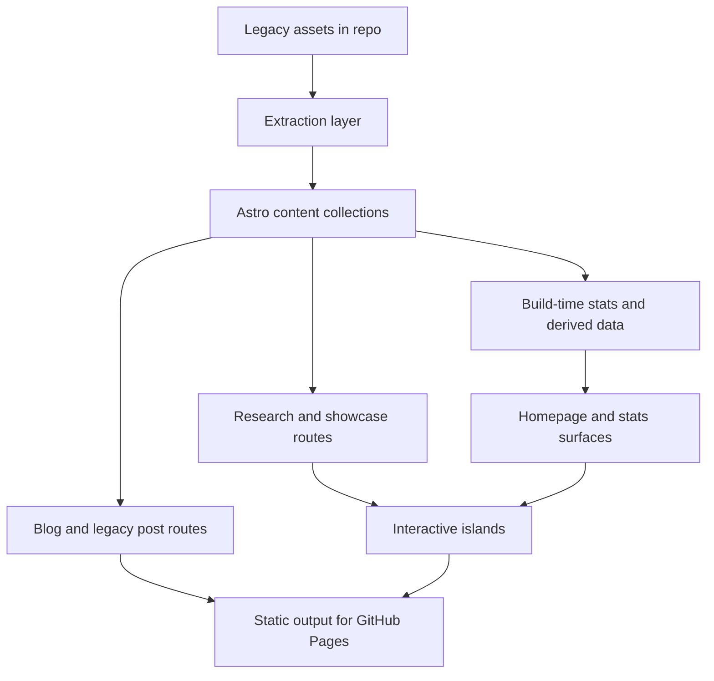
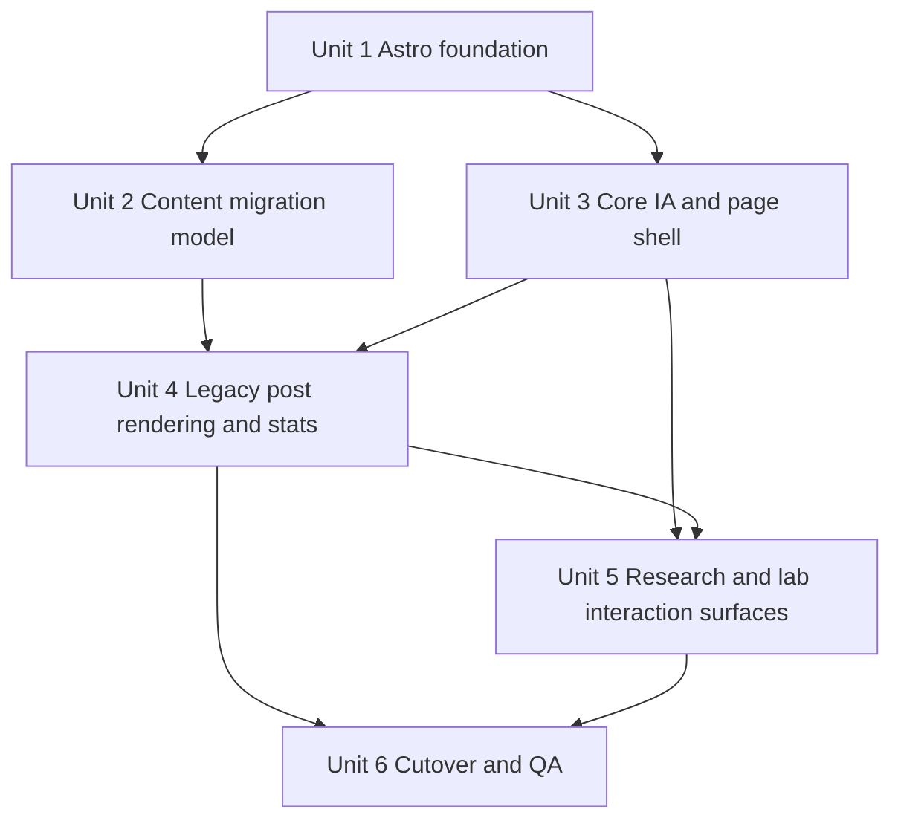

# feat: Rebuild the site as an Astro AI research hub

## Overview

将当前以 Hexo 产物形式保存在仓库中的旧博客，重建为一个基于 Astro 的个人 AI 研究网站。第一版不做“持续更新的实验室叙事”，而是围绕三条能力线搭建一个轻量完整闭环：
- 内容发布：保留并迁移历史文章，同时为后续新文章建立更现代的内容结构
- 研究展示：让首页、研究页、成果页能够明确表达你在研究什么、做出了什么
- 轻量交互：用少量图表、参数切换、展示型 demo 和统计反馈增强表达，而不扩张为复杂产品

本计划将当前仓库视为“旧内容资产仓”，而不是完整的 Hexo 源项目。实现路径以重建为主、迁移为辅，并保持 GitHub Pages 可持续部署。

## Problem Frame

当前仓库只保留了旧站的已发布静态文件，缺少完整的 Hexo 源配置、主题和内容源目录。继续围绕 Hexo 做增量维护，既无法自然承接你对品牌升级和交互表达的需求，也会把后续演进继续绑在旧信息架构上。

需要解决的问题不是“把旧博客继续跑起来”，而是：
- 如何把现有文章、图片和 URL 资产转成 Astro 可持续维护的内容源
- 如何在第一版内，用更好的首页叙事和内容组织替代传统博客归档式首页
- 如何让轻量统计和交互表达真正服务你的研究节奏，而不是制造额外心理负担

这份计划以 requirements 文档为产品源头，不重新发明产品行为，只把它们转成可实施的技术结构与执行顺序（见 origin: `docs/brainstorms/2026-04-14-astro-ai-research-site-requirements.md`）。

## Requirements Trace

- R1, R4. 用 Astro 重建，并形成内容、展示、轻交互三条并存的第一版闭环。
- R2, R3, R12, R14. 将站点设计为对你低负担、长期可用的研究网站，而非高频更新人设系统。
- R5, R6, R7, R8. 建立综合首页与清晰一级结构，保留旧文章但降权，中文优先。
- R9, R10, R11. 提供真实可访问的轻交互入口，并把交互定位在研究表达增强而非产品化功能。
- R13. 以节奏反馈和主题投入反馈为第一版统计重点。
- Success Criteria 1-5. 新站需要在自我使用、首次访客理解、旧文保留、轻交互表达与统计支持这五个层面都成立。

## Scope Boundaries

- 第一版不复刻旧 NexT/Hexo 视觉与信息架构。
- 第一版不建设完整双语内容系统。
- 第一版不引入需要服务端状态、鉴权或数据库写入的复杂交互功能。
- 第一版不把统计做成强打卡或强运营系统。
- 第一版不承诺自动完美迁移所有历史 HTML 为高质量 Markdown；必要时允许保留部分 HTML 片段或进行少量人工清理。

## Context & Research

### Relevant Code and Patterns

- `public/search.xml` 已包含旧文章的结构化条目：标题、URL、HTML 内容、分类和标签。这是最适合的迁移主输入源，优先级高于逐页解析 `2019/`、`2020/` 下的 HTML。
- `2019/**`、`2020/**` 目录下保留了历史文章路径和配套图片资源，可作为正文图片与 legacy URL 对照资产。
- `about/index.html` 保留了旧站“关于”页文字，可作为新站介绍页的迁移素材。
- 仓库当前不存在 `package.json`、`astro.config.*`、`_config.yml`、`source/`、`themes/` 等源项目文件，说明应按“新 Astro 项目落地到现仓库”规划，而不是做源码层的 Hexo 原位迁移。

### Institutional Learnings

- 未发现 `docs/solutions/` 中的既有项目经验文档，因此本次计划主要依赖仓库现状与官方文档约束。

### External References

- Astro Content Collections: https://docs.astro.build/en/guides/content-collections/
- Astro MDX: https://docs.astro.build/en/guides/integrations-guide/mdx/
- Astro Client Directives: https://docs.astro.build/en/reference/directives-reference/
- Astro GitHub Pages deployment: https://docs.astro.build/en/guides/deploy/github/

这些参考共同支撑了四个关键判断：
- 内容应进入 `src/content` 体系，而不是继续散落为手写页面
- 文章格式应允许 Markdown/MDX 与原始 HTML 混合过渡
- 轻交互应采用 Astro 岛屿模式，按优先级渐进 hydrate，而不是站点全量前端化
- 部署应切到 Astro 官方推荐的 GitHub Pages 工作流，而不是继续提交发布后的整站 HTML

## Key Technical Decisions

- 以“重建新站 + 迁移旧资产”为主路径，而不是尝试恢复 Hexo 源工程：当前仓库不具备完整 Hexo 源结构，继续围绕 Hexo 修复只会增加不确定性。
- 以 `public/search.xml` 作为历史文章迁移主输入源，以历史 HTML 和图片目录作为补充：这能保留标题、标签、分类、正文和 URL，对迁移准确性与批量化最有利。
- 文章内容进入 Astro Content Collections，第一版允许 Markdown/MDX 混合并保留部分 HTML：相比强行一次性把所有旧 HTML 清洗成纯 Markdown，这种方式更稳，也更适合保留代码块、表格、图片与复杂片段。
- 首页与新内容结构使用新路由组织，但旧文章 URL 尽量保持兼容：用户进入新站时先看到新的研究站结构，历史内容继续可访问，满足“保留但降权”。
- 交互与统计都采用静态优先、构建期衍生数据、按需 hydrate：这样能保留 GitHub Pages 的简单部署模型，也能让统计与图表为表达服务，而不引入运行时复杂度。
- 第一版只沉淀少量可复用交互模式：主题投入图表、节奏反馈视图、少量展示型实验页；不引入通用“实验平台”抽象。

## Open Questions

### Resolved During Planning

- 历史内容从哪里迁移最稳？  
  结论：优先使用 `public/search.xml`，因为它已经把旧文的标题、URL、正文、分类和标签整合到了统一结构里。

- 第一版交互是否需要服务端或数据库能力？  
  结论：不需要。第一版采用静态生成与渐进 hydrate，统计数据在构建期根据内容元数据计算。

- 历史 URL 是否需要完全重写到新路由下？  
  结论：不需要。新站可以有新的一级内容入口，但历史文章应继续通过 legacy 路径可访问，以减少内容断链和迁移风险。

### Deferred to Implementation

- 历史 HTML 转 Markdown/MDX 的清洗粒度需要在真实内容上试跑后确定，特别是含复杂表格、数学片段或异常 HTML 的文章。
- 关于页与部分旧文是否需要人工改写为更符合当前研究身份的文案，取决于迁移后的整体观感与时间预算。
- 第一版展示型实验页的具体题材需要结合你近期最想展示的研究成果来定，但不影响当前站点骨架规划。

## High-Level Technical Design

> *This illustrates the intended approach and is directional guidance for review, not implementation specification. The implementing agent should treat it as context, not code to reproduce.*

提炼思路如下：
- 旧站不是直接“包一层新皮”，而是先抽取成结构化内容，再进入 Astro 内容层
- “博客 / 研究 / 实验 / 统计”共用同一套内容与衍生数据，而不是各自维护一份数据
- 交互只出现在真正需要增强理解的页面和模块中，并且按需 hydrate

## Implementation Units

- [ ] **Unit 1: 建立 Astro 站点基础与部署基线**

**Goal:** 在当前仓库中落下新的 Astro 工程骨架、全站基础布局与 GitHub Pages 部署基线，为后续迁移和页面开发提供稳定底座。

**Requirements:** R1, R4, R8

**Dependencies:** None

**Files:**
- Create: `package.json`
- Create: `astro.config.mjs`
- Create: `tsconfig.json`
- Create: `src/env.d.ts`
- Create: `src/layouts/BaseLayout.astro`
- Create: `src/styles/global.css`
- Create: `src/pages/index.astro`
- Create: `.github/workflows/deploy.yml`
- Test: `tests/e2e/smoke.spec.ts`

**Approach:**
- 在仓库根目录引入 Astro 项目结构，建立新的 `src/`、样式入口和基础布局。
- 先提供最小可构建的首页骨架，确保后续工作基于新结构推进，而不是继续编辑旧静态文件。
- GitHub Pages 部署配置从“提交生成产物”切换为“由 GitHub Actions 构建与发布 Astro 输出”。

**Patterns to follow:**
- Astro 官方 GitHub Pages 部署指导
- 当前仓库根目录保留的静态资源组织方式，如 `public/` 与顶层资源路径

**Test scenarios:**
- Happy path: 仓库在无历史 Hexo 源配置的前提下，能够生成 Astro 静态输出并包含首页。
- Edge case: GitHub Pages 子路径或根路径配置不会让站内链接与静态资源前缀失效。
- Error path: 当内容集合尚未建立时，首页骨架仍能安全构建，不因空数据报错。

**Verification:**
- 新 Astro 结构成为默认开发入口。
- GitHub Pages 发布路径与本地构建输出的资源引用一致。

- [ ] **Unit 2: 建立内容模型与历史内容迁移管线**

**Goal:** 把旧站现有内容资产转成 Astro 可持续维护的内容源，为文章、研究展示和统计提供统一数据层。

**Requirements:** R2, R4, R6, R7, R8

**Dependencies:** Unit 1

**Files:**
- Create: `src/content.config.ts`
- Create: `src/content/posts/`
- Create: `src/content/research/`
- Create: `src/content/lab/`
- Create: `src/content/site/about.md`
- Create: `src/data/site.ts`
- Create: `scripts/extract-legacy-content.mjs`
- Create: `tests/unit/content/extract-legacy-content.test.ts`
- Create: `tests/unit/content/content-schema.test.ts`
- Create: `tests/e2e/about-page.spec.ts`

**Approach:**
- 设计适合第一版的内容集合：至少包括历史/新文章、研究成果页、实验页三类。
- 用提取脚本读取 `public/search.xml`，生成可进入 `src/content/posts/` 的内容文件与 frontmatter 元数据。
- 保留 legacy URL、日期、分类、标签、摘要与原始正文；当 HTML 无法稳定转成纯 Markdown 时，允许落成 MDX 或保留必要 HTML 片段。
- 关于页内容与站点基础资料从旧页面中提取，进入新的站点配置或内容文件。

**Execution note:** 先做一小批代表文章的迁移验证，再批量应用到全量历史文章，避免一开始把错误模式复制到所有内容上。

**Patterns to follow:**
- `public/search.xml` 中现成的 `entry -> title/url/content/categories/tags` 结构
- Astro Content Collections 的 schema 校验和类型约束方式

**Test scenarios:**
- Happy path: 一篇包含标题、标签、分类和普通正文的旧文章能被正确提取为内容条目。
- Edge case: 含中文 slug、空标签、单分类或缺少摘要的旧文章仍能生成稳定的 frontmatter。
- Edge case: 正文中包含图片、代码块、表格时，输出内容能保留可渲染结构而不是丢失关键内容。
- Error path: `search.xml` 某条目字段缺失或 HTML 不规范时，提取脚本会标记并跳过/降级，而不是中断全部迁移。
- Integration: 提取出的内容能被 `src/content.config.ts` 校验通过，并被页面层消费。

**Verification:**
- 新站文章、研究页和实验页都从统一内容层读取，而不是继续依赖旧静态 HTML。
- 至少一批历史文章可以在 Astro 中完整渲染并保留核心元信息。

- [ ] **Unit 3: 建立新的信息架构与全站页面骨架**

**Goal:** 用新的首页与一级页面结构，把站点从“博客归档”切换为“个人 AI 研究网站”。

**Requirements:** R1, R4, R5, R6, R7, R8

**Dependencies:** Unit 1

**Files:**
- Modify: `src/pages/index.astro`
- Create: `src/pages/blog/index.astro`
- Create: `src/pages/research/index.astro`
- Create: `src/pages/lab/index.astro`
- Create: `src/pages/about/index.astro`
- Create: `src/components/site/Header.astro`
- Create: `src/components/site/Footer.astro`
- Create: `src/components/home/Hero.astro`
- Create: `src/components/home/SectionShell.astro`
- Create: `src/components/home/FeaturedContent.astro`
- Create: `src/components/home/RecentWriting.astro`
- Create: `src/components/home/ResearchFocus.astro`
- Create: `tests/e2e/homepage.spec.ts`
- Create: `tests/e2e/navigation.spec.ts`

**Approach:**
- 首页按 requirements 中的综合首页方向组织，但将“研究方向 / 代表成果 / 近期内容”分成明确的轻量模块，而不是继续使用文章瀑布流作为首屏主体。
- 一级导航明确区分博客、研究、实验、关于，建立新的进入路径。
- 历史文章在结构上被纳入博客体系，但首页与导航不再围绕 archive/category/tag 组织。
- 页面骨架默认按移动端到桌面的渐进布局设计，避免新的研究站结构只在宽屏下成立。

**Patterns to follow:**
- requirements 中对综合首页、保留旧文但降权、中文优先的约束
- 当前仓库已有的“关于”“标签”“归档”概念，只保留其可复用信息，不保留其旧导航优先级

**Test scenarios:**
- Happy path: 首次访问首页时，用户能看到研究方向、代表成果和近期内容三个模块。
- Edge case: 当研究成果或实验内容仍然较少时，对应模块以轻量占位或精选呈现，不破坏首页结构。
- Edge case: 中文长标题、长标签或较长摘要不会导致首页和列表页布局失衡。
- Edge case: 首页和一级列表页在移动端仍保持清晰阅读顺序，不要求用户横向滚动才能理解主要信息。
- Integration: 主导航可以从任一页面进入博客、研究、实验和关于页，并保持一致的站点身份表达。

**Verification:**
- 新站首屏不再被旧博客归档式信息主导。
- 新导航结构能支撑后续内容、成果与实验长期共存。

- [ ] **Unit 4: 渲染历史文章、保留 legacy 路径并生成轻量统计**

**Goal:** 在新站中保留历史文章可访问性，同时让统计反馈与内容体系共享同一套数据。

**Requirements:** R5, R7, R9, R12, R13, R14

**Dependencies:** Unit 2, Unit 3

**Files:**
- Create: `src/pages/[year]/[month]/[day]/[slug].astro`
- Create: `src/pages/tags/[tag].astro`
- Create: `src/pages/categories/[category].astro`
- Create: `src/lib/content/legacy-paths.ts`
- Create: `src/lib/stats/site-stats.ts`
- Create: `src/components/stats/CadenceSummary.astro`
- Create: `src/components/stats/TopicDistributionSummary.astro`
- Create: `tests/e2e/legacy-posts.spec.ts`
- Create: `tests/e2e/taxonomy-pages.spec.ts`
- Create: `tests/unit/stats/site-stats.test.ts`

**Approach:**
- 旧文章页采用与 legacy URL 对齐的日期/slug 路由生成，优先维持可访问性。
- 标签和分类页只保留作为内容发现入口，不再承担整站主叙事。
- 统计在构建期根据内容集合计算，先覆盖“记录/发布节奏”和“主题投入分布”两类反馈。
- 统计展示语气和视觉需要偏支持性与观察性，不设计成排行榜、连续打卡或强 KPI 视图。

**Patterns to follow:**
- `public/search.xml` 中保留的 URL、分类和标签信息
- requirements 中“保留但降权”“轻量统计”“非羞耻化”的产品边界

**Test scenarios:**
- Happy path: 任一历史文章的 legacy URL 都能在新站中打开并显示标题、正文、标签和分类。
- Edge case: 中文 slug 与编码路径在生成静态页面后仍能正确映射。
- Edge case: 当某个标签或分类只有一篇文章时，其列表页仍能正常工作且不显得像主导航页面。
- Error path: 某篇历史文章元数据缺失时，页面层会显示降级信息或跳过统计，而不是整个构建失败。
- Integration: 节奏统计与主题统计会随着内容集合变化自动更新，并能在首页或指定统计模块中被消费。

**Verification:**
- 历史内容在新站中连续可访问。
- 统计模块来自真实内容数据，而不是手工维护的展示数字。

- [ ] **Unit 5: 建立研究展示页与第一批轻交互表达模块**

**Goal:** 让新站具备“研究成果主导的展示站”特征，并通过少量交互化模块增强表达。

**Requirements:** R4, R5, R6, R9, R10, R11, R13

**Dependencies:** Unit 3, Unit 4

**Files:**
- Create: `src/pages/research/[slug].astro`
- Create: `src/pages/lab/[slug].astro`
- Create: `src/components/research/ResearchCard.astro`
- Create: `src/components/research/ResearchTimeline.astro`
- Create: `src/components/interactive/TopicDistributionChart.astro`
- Create: `src/components/interactive/CadenceChart.astro`
- Create: `src/components/interactive/ParameterDemoShell.astro`
- Modify: `src/content/research/`
- Modify: `src/content/lab/`
- Create: `tests/e2e/research-pages.spec.ts`
- Create: `tests/e2e/lab-pages.spec.ts`

**Approach:**
- 研究页承载“你在研究什么、代表成果是什么、为什么值得看”这一层表达，区别于普通博客正文。
- 实验页只做少量可访问的展示型交互：例如主题投入图表、节奏图表、参数切换式解释模块，或单个研究 demo 容器。
- 客户端交互采用 Astro 岛屿模式，并按内容重要度选择延迟 hydration，避免首页和普通文章页承担不必要脚本成本。
- 所有统计与交互模块都需要有非图形化的文本说明或摘要，保证核心信息不依赖单一视觉图表才能被理解。

**Technical design:** *(directional guidance, not implementation specification)*
- 默认使用静态 Astro 组件输出内容结构与说明文案。
- 只有图表和需要浏览器交互的部件进入客户端岛屿。
- 低优先级、位于首屏下方或较重的交互模块优先采用惰性 hydrate，而不是默认首屏加载。

**Patterns to follow:**
- Astro client directives 关于 `client:idle` / `client:visible` 的优先级模型
- requirements 中“交互服务表达，不扩张为复杂产品”的定位

**Test scenarios:**
- Happy path: 研究页可以展示研究主题、代表成果与关联文章，不依赖实验页存在才成立。
- Happy path: 至少一类图表交互可访问，并能正确反映内容统计数据。
- Edge case: 当某个研究主题暂时没有实验页时，研究页仍然完整，不出现空洞的功能承诺。
- Edge case: 低优先级交互模块在未进入视口前不会阻塞主要内容阅读。
- Edge case: 统计图表在移动端、脚本延迟加载或辅助技术场景下，仍保留可理解的文本摘要与模块标题。
- Integration: 首页、研究页与实验页可以共享同一份统计/内容衍生数据，而不会各自维护副本。

**Verification:**
- 新站具备明确的“研究展示 + 轻交互表达”特征，而不是仅有博客列表。
- 交互模块不会反客为主，也不会把站点推向复杂应用。

- [ ] **Unit 6: 完成切换、回归检查与旧站资产清理策略**

**Goal:** 在不丢失历史内容和静态资源的前提下，把仓库主运行模式切换到 Astro，并建立可持续维护的收尾边界。

**Requirements:** R1, R4, R7, Success Criteria 1-5

**Dependencies:** Unit 4, Unit 5

**Files:**
- Modify: `.github/workflows/deploy.yml`
- Create: `README.md`
- Create: `tests/e2e/content-regression.spec.ts`
- Create: `tests/e2e/build-routing.spec.ts`

**Approach:**
- 明确哪些旧静态目录继续作为原始资产保留，哪些将不再作为站点运行入口。
- 为迁移后的关键页面做回归检查：首页、至少若干旧文、研究页、实验页、关于页。
- 在仓库说明中写清新的内容来源、部署方式和 legacy 资产角色，避免后续又回到“直接编辑发布产物”的维护方式。

**Patterns to follow:**
- 当前仓库中 legacy 文章与图片路径的现状
- 新 Astro 内容层与 GitHub Pages 工作流已经建立的最终结构

**Test scenarios:**
- Happy path: GitHub Pages 发布后，首页、博客页、研究页、实验页和关于页都可访问。
- Happy path: 至少抽样若干历史文章，其路径和图片资源在切换后仍保持可访问。
- Edge case: 没有研究或实验内容更新时，站点仍能稳定构建与发布。
- Error path: 某个 legacy 资源缺失时，页面应局部降级而不是导致整站导航失效。
- Integration: 新部署流程产出的站点可以完全替代旧根目录 HTML 作为对外发布结果。

**Verification:**
- 仓库的“真实站点来源”变成 Astro 源文件与构建流程。
- 维护者未来新增内容时，不需要再直接编辑历史发布产物。

## System-Wide Impact

- **Interaction graph:** `public/search.xml` 与 legacy 资源目录进入提取脚本；提取脚本产出的内容集合同时服务博客、研究、实验和统计模块；交互模块只消费派生数据或页面上下文，不自行维护独立状态源。
- **Error propagation:** 内容提取层的异常应尽量局部化到具体文章或页面，避免单篇旧文质量问题阻断整站构建。
- **State lifecycle risks:** 统计数据如果来自构建期派生，必须与内容集合同源，避免前台手工数字与真实内容脱节。
- **API surface parity:** 需要保留的外部表面主要是 legacy 文章 URL、关于页入口和关键静态资源路径。
- **Integration coverage:** 仅靠单元测试无法证明 legacy URL、静态资源路径、统计数据接线和惰性交互 hydration 是否正确，必须补齐端到端检查。
- **Responsive/accessibility:** 首页模块、研究卡片和统计图表都需要在移动端保持清晰信息顺序，并为核心统计提供文本摘要或语义替代。
- **Unchanged invariants:** 历史文章应继续可访问；第一版仍是静态站，不引入需要长期维护的后端运行时。

## Risks & Dependencies

| Risk | Mitigation |
|------|------------|
| `search.xml` 中的 HTML 清洗结果不稳定，导致部分旧文迁移质量参差 | 先用代表样本验证提取策略，允许第一版保留部分 HTML/MDX 混合，不追求一次性纯化全部内容 |
| 中文 slug 与 legacy 日期路径在 Astro 中映射复杂 | 以 legacy URL 为生成依据建立显式路由映射，而不是依赖默认 slug 逻辑猜测 |
| 首页容易重新滑回“博客列表首页”或“作品集首页”单一叙事 | 将首页模块围绕 requirements 的三大板块实现，并在回归检查中验证三者是否同时存在 |
| 交互模块范围膨胀，拖慢整体交付 | 只实现少量可复用模式，任何新交互如果需要服务端状态、复杂表单或独立产品逻辑，均延期 |
| 统计模块引入自我施压感 | 统计仅展示节奏与主题投入，不展示竞争式排行、打卡 streak 或强运营语气 |

## Documentation / Operational Notes

- 需要更新 `README.md`，明确说明仓库已从旧站发布产物仓转为 Astro 源仓。
- 若保留 legacy 目录作为原始资产，应在文档中说明它们的角色是“迁移输入/静态资源来源”，而不是未来持续编辑入口。
- 如果 GitHub Pages 使用自定义域名，切换时需要确认新的部署流程与域名、`CNAME`、资源前缀策略一致。

## Sources & References

- **Origin document:** `docs/brainstorms/2026-04-14-astro-ai-research-site-requirements.md`
- Related code: `public/search.xml`
- Related code: `about/index.html`
- Related code: `2019/`
- Related code: `2020/`
- External docs: https://docs.astro.build/en/guides/content-collections/
- External docs: https://docs.astro.build/en/guides/integrations-guide/mdx/
- External docs: https://docs.astro.build/en/reference/directives-reference/
- External docs: https://docs.astro.build/en/guides/deploy/github/
