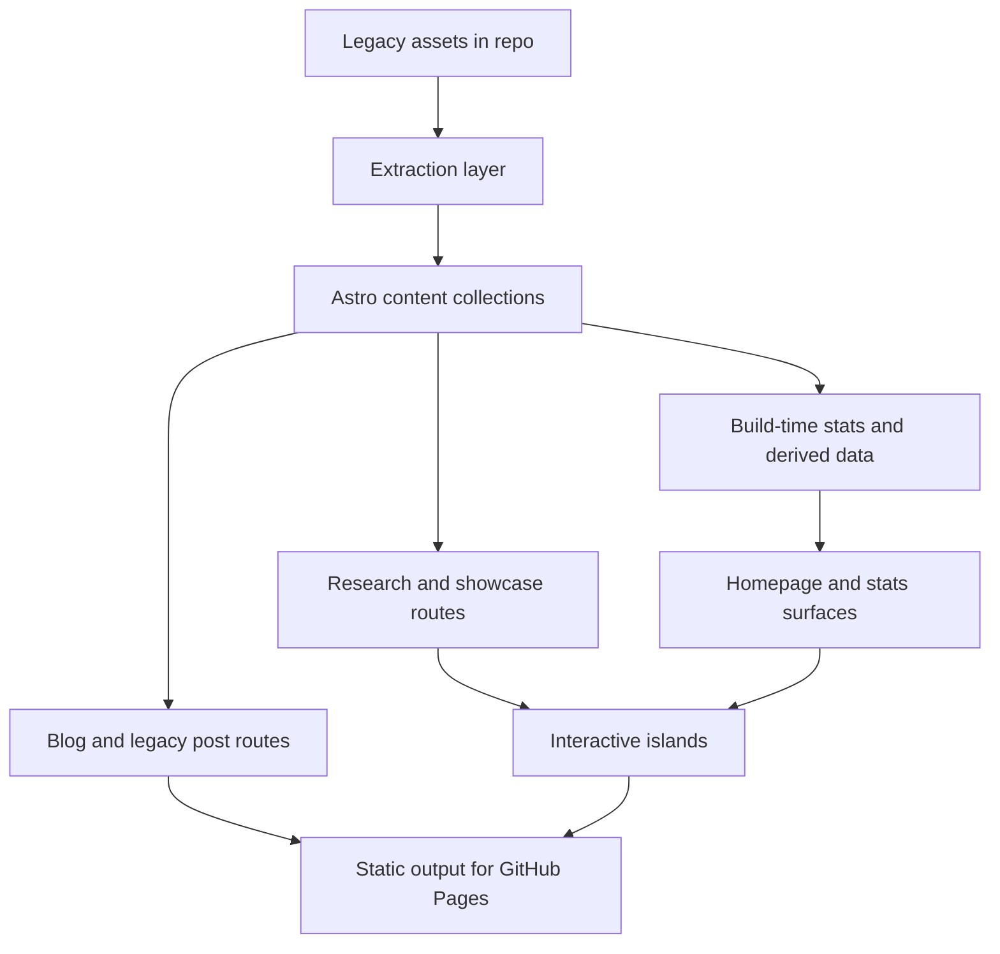

# feat: Rebuild the site as an Astro AI research hub

## Overview

将当前以 Hexo 产物形式保存在仓库中的旧博客，重建为一个基于 Astro 的个人 AI 研究网站。第一版不做“持续更新的实验室叙事”，而是围绕三条能力线搭建一个轻量完整闭环：
- 内容发布：保留并迁移历史文章，同时为后续新文章建立更现代的内容结构
- 研究展示：让首页、研究页、成果页能够明确表达你在研究什么、做出了什么
- 轻量交互：用少量图表、参数切换、展示型 demo 和统计反馈增强表达，而不扩张为复杂产品

本计划将当前仓库视为“旧内容资产仓”，而不是完整的 Hexo 源项目。实现路径以重建为主、迁移为辅，并保持 GitHub Pages 可持续部署。

## Problem Frame

当前仓库只保留了旧站的已发布静态文件，缺少完整的 Hexo 源配置、主题和内容源目录。继续围绕 Hexo 做增量维护，既无法自然承接你对品牌升级和交互表达的需求，也会把后续演进继续绑在旧信息架构上。

需要解决的问题不是“把旧博客继续跑起来”，而是：
- 如何把现有文章、图片和 URL 资产转成 Astro 可持续维护的内容源
- 如何在第一版内，用更好的首页叙事和内容组织替代传统博客归档式首页
- 如何让轻量统计和交互表达真正服务你的研究节奏，而不是制造额外心理负担

这份计划以 requirements 文档为产品源头，不重新发明产品行为，只把它们转成可实施的技术结构与执行顺序（见 origin: `docs/brainstorms/2026-04-14-astro-ai-research-site-requirements.md`）。

## Requirements Trace

- R1, R4. 用 Astro 重建，并形成内容、展示、轻交互三条并存的第一版闭环。
- R2, R3, R12, R14. 将站点设计为对你低负担、长期可用的研究网站，而非高频更新人设系统。
- R5, R6, R7, R8. 建立综合首页与清晰一级结构，保留旧文章但降权，中文优先。
- R9, R10, R11. 提供真实可访问的轻交互入口，并把交互定位在研究表达增强而非产品化功能。
- R13. 以节奏反馈和主题投入反馈为第一版统计重点。
- Success Criteria 1-5. 新站需要在自我使用、首次访客理解、旧文保留、轻交互表达与统计支持这五个层面都成立。

## Scope Boundaries

- 第一版不复刻旧 NexT/Hexo 视觉与信息架构。
- 第一版不建设完整双语内容系统。
- 第一版不引入需要服务端状态、鉴权或数据库写入的复杂交互功能。
- 第一版不把统计做成强打卡或强运营系统。
- 第一版不承诺自动完美迁移所有历史 HTML 为高质量 Markdown；必要时允许保留部分 HTML 片段或进行少量人工清理。

## Context & Research

### Relevant Code and Patterns

- `public/search.xml` 已包含旧文章的结构化条目：标题、URL、HTML 内容、分类和标签。这是最适合的迁移主输入源，优先级高于逐页解析 `2019/`、`2020/` 下的 HTML。
- `2019/**`、`2020/**` 目录下保留了历史文章路径和配套图片资源，可作为正文图片与 legacy URL 对照资产。
- `about/index.html` 保留了旧站“关于”页文字，可作为新站介绍页的迁移素材。
- 仓库当前不存在 `package.json`、`astro.config.*`、`_config.yml`、`source/`、`themes/` 等源项目文件，说明应按“新 Astro 项目落地到现仓库”规划，而不是做源码层的 Hexo 原位迁移。

### Institutional Learnings

- 未发现 `docs/solutions/` 中的既有项目经验文档，因此本次计划主要依赖仓库现状与官方文档约束。

### External References

- Astro Content Collections: https://docs.astro.build/en/guides/content-collections/
- Astro MDX: https://docs.astro.build/en/guides/integrations-guide/mdx/
- Astro Client Directives: https://docs.astro.build/en/reference/directives-reference/
- Astro GitHub Pages deployment: https://docs.astro.build/en/guides/deploy/github/

这些参考共同支撑了四个关键判断：
- 内容应进入 `src/content` 体系，而不是继续散落为手写页面
- 文章格式应允许 Markdown/MDX 与原始 HTML 混合过渡
- 轻交互应采用 Astro 岛屿模式，按优先级渐进 hydrate，而不是站点全量前端化
- 部署应切到 Astro 官方推荐的 GitHub Pages 工作流，而不是继续提交发布后的整站 HTML

## Key Technical Decisions

- 以“重建新站 + 迁移旧资产”为主路径，而不是尝试恢复 Hexo 源工程：当前仓库不具备完整 Hexo 源结构，继续围绕 Hexo 修复只会增加不确定性。
- 以 `public/search.xml` 作为历史文章迁移主输入源，以历史 HTML 和图片目录作为补充：这能保留标题、标签、分类、正文和 URL，对迁移准确性与批量化最有利。
- 文章内容进入 Astro Content Collections，第一版允许 Markdown/MDX 混合并保留部分 HTML：相比强行一次性把所有旧 HTML 清洗成纯 Markdown，这种方式更稳，也更适合保留代码块、表格、图片与复杂片段。
- 首页与新内容结构使用新路由组织，但旧文章 URL 尽量保持兼容：用户进入新站时先看到新的研究站结构，历史内容继续可访问，满足“保留但降权”。
- 交互与统计都采用静态优先、构建期衍生数据、按需 hydrate：这样能保留 GitHub Pages 的简单部署模型，也能让统计与图表为表达服务，而不引入运行时复杂度。
- 第一版只沉淀少量可复用交互模式：主题投入图表、节奏反馈视图、少量展示型实验页；不引入通用“实验平台”抽象。

## Open Questions

### Resolved During Planning

- 历史内容从哪里迁移最稳？  
  结论：优先使用 `public/search.xml`，因为它已经把旧文的标题、URL、正文、分类和标签整合到了统一结构里。

- 第一版交互是否需要服务端或数据库能力？  
  结论：不需要。第一版采用静态生成与渐进 hydrate，统计数据在构建期根据内容元数据计算。

- 历史 URL 是否需要完全重写到新路由下？  
  结论：不需要。新站可以有新的一级内容入口，但历史文章应继续通过 legacy 路径可访问，以减少内容断链和迁移风险。

### Deferred to Implementation

- 历史 HTML 转 Markdown/MDX 的清洗粒度需要在真实内容上试跑后确定，特别是含复杂表格、数学片段或异常 HTML 的文章。
- 关于页与部分旧文是否需要人工改写为更符合当前研究身份的文案，取决于迁移后的整体观感与时间预算。
- 第一版展示型实验页的具体题材需要结合你近期最想展示的研究成果来定，但不影响当前站点骨架规划。

## High-Level Technical Design

> *This illustrates the intended approach and is directional guidance for review, not implementation specification. The implementing agent should treat it as context, not code to reproduce.*

## Implementation Units

- [x] **Unit 1: 建立 Astro 站点基础与部署基线**
- [x] **Unit 2: 建立内容模型与历史内容迁移管线**
- [x] **Unit 3: 建立新的信息架构与全站页面骨架**
- [x] **Unit 4: 构建文章渲染、legacy 路由与统计数据层**
- [x] **Unit 5: 建立研究 / 实验展示与轻交互入口**
- [x] **Unit 6: 完成切换、验收与部署收口**

## Verification

- 当前 Astro 站点已经替代旧静态首页作为主入口。
- 历史文章与 legacy URL 仍然可访问。
- `blog`、`research`、`lab`、`about` 四条主路径成立。
- 构建期统计与轻量交互入口已经形成第一版闭环。
- 后续策略主题工作建立在这个 Astro 研究站底座之上，而不是继续围绕旧 Hexo 产物演进。
