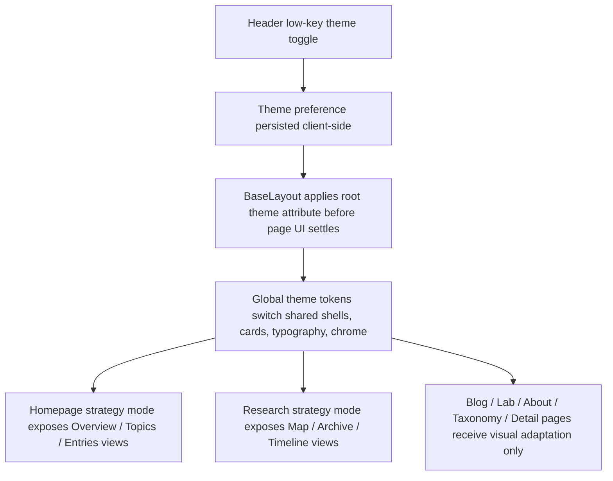

# feat: Add strategy interface theme

> Historical note: this was the first strategy-theme implementation plan. It should no longer be used as the execution entrypoint. Use `docs/plans/2026-04-16-001-feat-sector-command-theme-governance-plan.md` and later completed follow-up plans instead.

## Overview

为现有 Astro 站点增加一个可切换的第二主题，在保留默认主题的前提下，提供“策略界面主题”。该主题面向整站生效，但重点强化首页与研究页：首页转向总控台式信息视图，研究页转向地图与档案结合的探索视图，其余页面先完成统一的视觉适配与导航连续性。整体方向以“档案库科技系统”为核心，不做赛博朋克或重度游戏化系统。

## Problem Frame

当前站点已经具备博客、研究、实验三条内容线和一套较完整的统一视觉，但它仍主要以内容站方式组织体验。用户希望新增一种更有辨识度的主题模式，让站点在保留内容清晰度的前提下，呈现更强的策略界面感，尤其要让首页和研究页拥有“指挥面板”与“地图/档案”式操作体验，而不是只停留在配色变化上（see origin: `docs/brainstorms/2026-04-15-strategy-interface-theme-requirements.md`）。

## Requirements Trace

- R1. 保留默认主题，同时新增可切换的策略界面主题。
- R2. 主题切换入口放在全站导航中，但保持低调。
- R3. 主题选择需要被记忆。
- R4. 策略主题采用“档案库科技系统”方向，而不是赛博朋克或具体游戏仿制。
- R5. 主题价值落在交互层，而不仅是换肤。
- R6. 首页在策略主题下提供总控台式视图切换。
- R7. 研究页在策略主题下提供地图与档案结合的探索方式。
- R8. 整站都能切换到策略主题，但首页和研究页是第一优先级。
- R9. 首页和研究页在策略主题下使用不同视图分工。
- R10. 主题不应损害信息层级、导航清晰度和内容理解路径。

## Scope Boundaries

- 不移除或弱化当前默认主题。
- 不新增角色、任务、积分、成就等重度游戏化机制。
- 不在第一版为所有页面引入同等级别的交互状态。
- 不把研究页做成复杂画布、自由拖拽图或强依赖动画的系统。
- 不要求博客正文、实验页和 about 页具备与首页/研究页同级的视图切换。

## Context & Research

### Relevant Code and Patterns

- `src/layouts/BaseLayout.astro` 是全站共享布局入口，适合承载主题状态、根级属性和全局初始化逻辑。
- `src/components/site/Header.astro` 当前集中渲染导航，是最合适的低调主题切换入口。
- `src/styles/global.css` 已经通过 `:root` 变量和共享类名管理大部分视觉语言，适合增设第二套主题 token，而不是分裂成独立页面样式。
- `src/pages/index.astro` 通过 `Hero`、`SectionShell`、统计组件和内容聚合函数构成首页，说明首页已经具备被重排为“总控台视图”的基础。
- `src/pages/research/index.astro` 与 `src/components/site/ChannelHero.astro`、`src/components/research/ResearchCard.astro`、`src/components/research/ResearchTimeline.astro` 共同构成研究页，适合作为“地图/档案/轨迹”切换的骨架。
- `src/components/interactive/ParameterDemoShell.astro` 已有轻量按钮切换面板的客户端脚本模式，可作为首页和研究页视图切换的现成交互参考。
- `tests/e2e/smoke.spec.ts` 与 `tests/e2e/routes.spec.ts` 已覆盖核心入口和若干交互渲染，可扩展为主题切换与持久化验证。

### Institutional Learnings

- `docs/solutions/workflow-issues/hexo-to-astro-content-migration-workflow-2026-04-14.md` 提醒这类跨站点层级改造要把共享 concern 分开建模。虽然它主要讲迁移，但同样说明共享布局、内容路由和静态资源不应在一次跨站点改造里被混成隐式逻辑。

### External References

- None. 这次规划直接基于当前代码结构与已有模式，不额外引入外部框架或新交互体系。

## Key Technical Decisions

- 使用“默认主题 + 策略主题”的双主题模型，而不是一次性重写整站视觉：这样能保住稳定入口，并让策略主题拥有明确边界。
- 只持久化“主题选择”，不持久化首页/研究页的具体视图：主题是用户偏好，页面视图是轻量探索状态，分开处理能显著降低状态复杂度。
- 主题选择通过共享布局尽早应用到根节点：这样整站切换一致，也能避免只有局部页面被主题化。
- 首页策略主题采用 `总览 / 主题 / 入口` 三视图：总览负责总控台感，主题聚焦研究脉络，入口负责把人送往博客、研究和实验。
- 研究页策略主题采用 `地图 / 档案 / 轨迹` 三视图：地图负责方向探索，档案负责按研究条目理解内容，轨迹负责时间向上的最近增长。
- 非首页/研究页先做视觉统一与导航连续性，不做新一轮交互系统：这满足 R8 和 R10，也能把第一版复杂度控制在合理范围内。
- 研究页中的“地图”采用轻量节点/区块式表达，而不是复杂图引擎或自由布局：这样更符合当前站点体量，也更容易守住清晰度。

## Open Questions

### Resolved During Planning

- 主题选择是否持久化：是，但仅记忆主题模式，不记忆首页和研究页的局部视图。
- 首页在策略主题下最合适的视图分工：`总览 / 主题 / 入口`。
- 研究页在策略主题下最合适的视图分工：`地图 / 档案 / 轨迹`。
- 研究页中的“地图”采用何种表达：采用轻量节点/分区式布局，不采用复杂图谱引擎。
- 非核心页面的策略主题适配范围：做视觉与导航统一，不做额外多视图交互。

### Deferred to Implementation

- 根级主题属性采用何种具体命名、序列化和值回退约定，可在写代码时根据现有类名和 Astro 布局约束确定。
- 首页与研究页的视图切换是否抽成共享组件，还是分别保留更清晰的专用实现，需要在实现中结合重复度判断。
- 策略主题下具体的颜色 token、边框密度和纹理强度需要通过真实页面观感微调，属于执行期设计校准。

## High-Level Technical Design

> *This illustrates the intended approach and is directional guidance for review, not implementation specification. The implementing agent should treat it as context, not code to reproduce.*

## Implementation Units

- [ ] **Unit 1: Establish theme state and navigation toggle**

**Goal:** 为整站建立稳定的双主题状态模型，并把低调的切换入口接到导航中。

**Requirements:** R1, R2, R3, R8, R10

**Dependencies:** None

**Files:**
- Modify: `src/layouts/BaseLayout.astro`
- Modify: `src/components/site/Header.astro`
- Modify: `src/styles/global.css`
- Modify: `src/data/site.ts`
- Create: `tests/e2e/theme.spec.ts`

**Approach:**
- 在共享布局层定义默认主题与策略主题的状态契约，并确保默认主题仍然是无脚本场景下的稳定回退。
- 将主题切换控件放入导航区，但通过文案、尺寸和位置保持“可发现但不主导”的存在感。
- 将主题应用到根级属性或等价的全站选择器，使所有页面都能从同一主题来源读取样式和展示模式。
- 主题记忆仅针对主题本身；页面内部的面板切换不做跨页面持久化。

**Execution note:** 先补浏览器级失败用例，固定主题切换、持久化与跨页保持行为，再做共享布局与样式改造。

**Patterns to follow:**
- `src/layouts/BaseLayout.astro`
- `src/components/site/Header.astro`
- `src/components/interactive/ParameterDemoShell.astro`

**Test scenarios:**
- Happy path: 首次访问 `/` 时站点以默认主题渲染，导航中可见主题切换入口。
- Happy path: 在首页切换到策略主题后刷新页面，站点保持在策略主题。
- Happy path: 在策略主题下进入 `/research/` 或 `/blog/`，根级主题状态保持一致。
- Edge case: 本地已有未知或过期主题值时，页面回退到默认主题而不是进入坏状态。
- Error path: 浏览器无法读取或写入持久化存储时，站点仍以默认主题正常渲染，导航不失效。
- Integration: 通过键盘聚焦导航开关并触发切换时，主题切换与可见状态反馈保持一致。
- Integration: 在任意页面切换主题后再通过导航跨页浏览，视觉模式保持一致。

**Verification:**
- 整站存在一个统一、低调且可访问的主题开关。
- 用户能跨刷新和跨页面保持同一主题。

- [ ] **Unit 2: Build shared strategy-theme visual system**

**Goal:** 为共享壳层建立“档案库科技系统”视觉语言，并确保整站切换时形成一致感。

**Requirements:** R4, R8, R10

**Dependencies:** Unit 1

**Files:**
- Modify: `src/styles/global.css`
- Modify: `src/layouts/BaseLayout.astro`
- Modify: `src/components/site/Header.astro`
- Modify: `src/components/site/Footer.astro`
- Modify: `src/components/site/ChannelHero.astro`
- Modify: `src/components/site/ArticleShell.astro`
- Modify: `src/components/site/EntryDetailShell.astro`
- Modify: `src/components/site/TaxonomyPage.astro`
- Test: `tests/e2e/theme.spec.ts`

**Approach:**
- 在现有 token 体系上增加策略主题变量，而不是复制整份样式文件。
- 共享面板、频道头部、导航、按钮、标签、卡片和正文容器统一切换到档案式面板语言，使非核心页面也具备“已进入同一主题系统”的连续性。
- 保持博客正文与详情页的排版、密度和对比度在可读阈值内，不把主题表达建立在正文花哨化上。
- 次级页面只做视觉升级与局部元信息重排，不在本单元引入额外交互状态。

**Patterns to follow:**
- `src/styles/global.css` 中现有的 `:root` token 和共享类
- `src/components/site/ChannelHero.astro`
- `src/components/site/ArticleShell.astro`

**Test scenarios:**
- Happy path: 切换到策略主题后，`/blog/`、`/lab/`、`/about/` 与详情页共享外层视觉模式，而不是仍停留在默认主题外观。
- Edge case: 长标题、多个 taxonomy chip 和较长摘要在策略主题下仍保持清晰布局，不出现严重溢出。
- Integration: 在策略主题下从博客列表、研究详情、标签页之间切换时，共享页头和内容壳层保持一致表现。

**Verification:**
- 非首页/研究页即使没有新交互，也能明显归属于策略主题而非未适配页面。
- 文章正文与详情内容仍然保持可读。

- [ ] **Unit 3: Turn the homepage into a strategy-mode command center**

**Goal:** 在策略主题下把首页升级为总控台式入口，并提供清晰的首页视图切换。

**Requirements:** R5, R6, R8, R9, R10

**Dependencies:** Unit 1, Unit 2

**Files:**
- Modify: `src/pages/index.astro`
- Modify: `src/components/home/Hero.astro`
- Modify: `src/components/home/SectionShell.astro`
- Modify: `src/components/home/ResearchFocus.astro`
- Modify: `src/components/home/FeaturedContent.astro`
- Modify: `src/components/home/RecentWriting.astro`
- Modify: `src/components/stats/CadenceSummary.astro`
- Modify: `src/components/stats/TopicDistributionSummary.astro`
- Create: `src/components/home/HomeCommandViews.astro`
- Test: `tests/e2e/theme.spec.ts`

**Approach:**
- 默认主题继续保持当前线性首页，避免把新主题逻辑强行压回默认体验。
- 策略主题下新增首页控制条与三视图：`总览` 聚焦系统摘要、关键信号和高优先入口；`主题` 聚焦研究方向与主题反馈；`入口` 聚焦博客、实验和继续探索的去向。
- 视图切换复用轻量按钮与面板切换模式，不引入复杂状态容器。
- 所有原有首页关键信息都应保留可达，只是根据视图重点改变首屏与布局优先级。

**Execution note:** 先让首页三视图在浏览器测试里可切换、可断言，再收敛策略主题下的具体版式。

**Patterns to follow:**
- `src/pages/index.astro`
- `src/components/home/Hero.astro`
- `src/components/interactive/ParameterDemoShell.astro`

**Test scenarios:**
- Happy path: 在策略主题下访问首页，默认显示 `总览` 视图，并能看到总控台式的核心指标与入口。
- Happy path: 切换到 `主题` 视图后，研究方向和主题反馈区块成为主内容。
- Happy path: 切换到 `入口` 视图后，博客、研究、实验的前往入口清晰可见。
- Edge case: 在移动端宽度下，视图切换控件仍可操作，且单次只呈现当前视图的主要内容而不过载。
- Integration: 使用键盘逐个切换首页视图时，当前激活状态和对应内容面板保持一致。
- Integration: 从首页策略视图点击研究或实验入口后，主题保持不变，跳转结果与视图文案一致。

**Verification:**
- 首页在策略主题下不再只是“换肤后的旧首页”，而是具备清晰的总控台分视图体验。
- 默认主题首页保持现有线性阅读体验。

- [ ] **Unit 4: Add map/archive exploration modes to the research page**

**Goal:** 在策略主题下把研究页升级为“地图 + 档案 + 轨迹”的探索页。

**Requirements:** R5, R7, R8, R9, R10

**Dependencies:** Unit 1, Unit 2

**Files:**
- Modify: `src/pages/research/index.astro`
- Modify: `src/components/research/ResearchCard.astro`
- Modify: `src/components/research/ResearchTimeline.astro`
- Create: `src/components/research/ResearchModeSwitcher.astro`
- Create: `src/components/research/ResearchMapView.astro`
- Create: `src/components/research/ResearchArchiveView.astro`
- Test: `tests/e2e/theme.spec.ts`

**Approach:**
- 在策略主题下为研究页提供三视图：`地图` 用轻量节点/分区方式表达研究方向关系；`档案` 用更结构化的卷宗式卡片表达研究条目；`轨迹` 重用时间线理解最近增长。
- 地图视图的重点是帮助理解“有哪些方向、它们各自处于什么状态、从哪里继续深入”，而不是打造复杂图引擎。
- 档案视图要保留研究卡片的状态、焦点和入口信息，并强化目录感。
- 轨迹视图继续提供时间向上的增长感，使研究页不仅能看“方向”，也能看“最近如何演化”。

**Execution note:** 先把研究页三视图切换与默认落点固定住，再微调“地图”布局的视觉表达。

**Patterns to follow:**
- `src/pages/research/index.astro`
- `src/components/research/ResearchCard.astro`
- `src/components/research/ResearchTimeline.astro`
- `src/components/interactive/ParameterDemoShell.astro`

**Test scenarios:**
- Happy path: 在策略主题下访问 `/research/`，默认显示 `地图` 视图。
- Happy path: 切换到 `档案` 视图后，研究条目以卷宗式入口清晰展示并可进入详情页。
- Happy path: 切换到 `轨迹` 视图后，最近内容增长时间线可见。
- Edge case: 当研究条目数量较少或 focus 标签重复时，地图视图仍保持可理解布局，不出现空洞或误导性结构。
- Integration: 使用键盘切换研究页视图时，当前激活模式与展示面板始终一致。
- Integration: 在任一研究视图中点击研究条目进入详情页时，主题保持一致，且回到研究页后仍处于研究频道上下文。

**Verification:**
- 研究页在策略主题下具备明显不同于默认主题的探索节奏。
- 用户可以同时理解研究方向、研究条目和最近轨迹，而不是只能看到一套静态列表。

- [ ] **Unit 5: Adapt secondary pages and lock the behavior with browser coverage**

**Goal:** 为剩余页面完成策略主题适配，并把主题切换与视图行为通过端到端测试固定下来。

**Requirements:** R1, R3, R8, R10

**Dependencies:** Unit 1, Unit 2, Unit 3, Unit 4

**Files:**
- Modify: `src/pages/blog/index.astro`
- Modify: `src/pages/lab/index.astro`
- Modify: `src/pages/about/index.astro`
- Modify: `src/pages/blog/[slug].astro`
- Modify: `src/pages/research/[slug].astro`
- Modify: `src/pages/lab/[slug].astro`
- Modify: `src/pages/tags/[tag].astro`
- Modify: `src/pages/categories/[category].astro`
- Modify: `tests/e2e/smoke.spec.ts`
- Modify: `tests/e2e/routes.spec.ts`
- Modify: `tests/e2e/theme.spec.ts`

**Approach:**
- 对博客、实验、关于、taxonomy 和详情页做主题语义上的视觉补齐，包括标题区、元信息区、导航连续性和局部面板语言。
- 不在这些页面引入新的多视图交互，只保证它们在策略主题下看起来属于同一系统。
- 扩展 e2e 覆盖，把导航切换、主题持久化、首页视图切换、研究页视图切换和跨页面一致性全部锁住。
- 保持现有路由可访问性、legacy 页面渲染与代码/数学内容表现不被主题改造破坏。

**Patterns to follow:**
- `tests/e2e/routes.spec.ts`
- `tests/e2e/smoke.spec.ts`
- `src/components/site/ArticleShell.astro`
- `src/components/site/TaxonomyPage.astro`

**Test scenarios:**
- Happy path: 在策略主题下访问 `/blog/`、`/lab/`、`/about/`，页面外观与导航都处于策略主题。
- Happy path: 在策略主题下打开博客详情页、研究详情页和实验详情页，详情壳层继续保持统一。
- Happy path: 主题从首页切换后，legacy 文章路由与 taxonomy 路由仍可正常访问。
- Edge case: 主题切换后返回默认主题，首页和研究页不再显示策略主题专属视图控件。
- Integration: 主题切换、首页视图切换、研究页视图切换和跨页跳转可以在同一浏览器会话中连续成立。

**Verification:**
- 全站在两种主题下都能稳定访问。
- 主题新增不会回归现有 legacy 内容、详情页和 taxonomy 路由行为。

## System-Wide Impact

- **Interaction graph:** 主题状态会从 `Header` 触发，经 `BaseLayout` 扩散到全站共享壳层；首页与研究页额外引入轻量面板状态，但不影响其他频道的数据聚合逻辑。
- **Error propagation:** 这次改造主要是前端展示层与浏览器状态管理，失败应尽量回退到默认主题和默认视图，而不是阻断页面渲染。
- **State lifecycle risks:** 最主要风险是主题闪烁、错误持久化值和移动端面板密度过高；局部视图状态不跨页持久化可以降低状态污染。
- **API surface parity:** 不新增后端接口或内容 schema；现有路由和内容入口应保持不变。
- **Integration coverage:** 主题切换与视图切换需要浏览器级覆盖，单元级断言不足以证明跨页一致性与持久化行为。
- **Unchanged invariants:** 现有博客、研究、实验、详情页、legacy 路由、taxonomy 路由与内容来源模型保持不变；这次工作只改变展示模式与局部探索交互。

## Risks & Dependencies

| Risk | Mitigation |
|------|------------|
| 主题持久化在客户端应用过晚，导致首屏闪烁或默认主题短暂暴露 | 在共享布局层尽早应用主题状态，并保持默认主题为安全回退 |
| 策略主题过度追求风格，削弱信息清晰度 | 用需求 R10 作为主约束，优先保住导航、标题层级、正文可读性和移动端结构 |
| 首页与研究页加入视图切换后，移动端信息密度失控 | 将视图数量固定为三组轻量模式，并把移动端视为一屏一主任务而不是多面板并排 |
| 非核心页面适配不充分，整站切换后显得像半成品 | 通过 Unit 2 和 Unit 5 明确把共享壳层与次级页面纳入策略主题统一范围 |

## Documentation / Operational Notes

- 如果策略主题最终引入新的使用提示或显著改变首页/研究页导航方式，应同步更新 `src/content/site/about.md` 或站内相关说明文案。
- 若后续需要为内容维护者说明“哪些页面在策略主题下有额外视图”，可以再补充到 `/update` 或单独的站点维护文档中；本计划不把这一步列为首版阻塞项。

## Sources & References

- **Origin document:** `docs/brainstorms/2026-04-15-strategy-interface-theme-requirements.md`
- Related code: `src/layouts/BaseLayout.astro`
- Related code: `src/components/site/Header.astro`
- Related code: `src/pages/index.astro`
- Related code: `src/pages/research/index.astro`
- Related code: `src/components/interactive/ParameterDemoShell.astro`
- Institutional learning: `docs/solutions/workflow-issues/hexo-to-astro-content-migration-workflow-2026-04-14.md`
