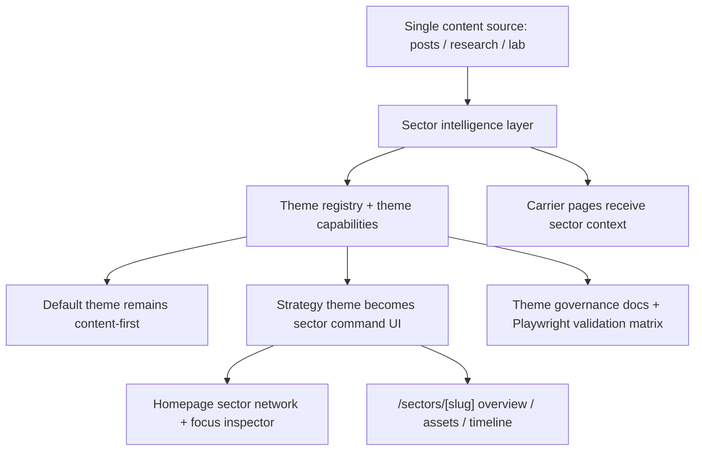

# feat: Rebuild strategy theme as sector command UI with governance

## Overview

将现有 Astro 站点中的策略主题从“档案库科技系统 + 轻量模式切换”升级为“重度策略指挥界面”，并同步建立多主题长期维护治理规则。新的策略主题不再以频道为首页主角，而是以主题战区网络、战区情报面板和战区详情页为核心体验；博客、研究和实验保留为资产载体。与此同时，主题系统需要从“当前双主题可用”升级为“未来可扩展多主题且可持续维护”的结构，确保后续新增内容、改动代码或新增主题时，都能沿同一套标准工作。

## Problem Frame

当前实现已经完成了一个可切换的默认主题与策略主题，但其核心仍沿用旧计划中的“档案库科技系统”方向：主题切换稳定、整站视觉统一、首页和研究页有轻量视图切换，但整体仍更像内容站而不是重度策略游戏主界面。用户现已明确把方向修正为“内容资产指挥中心”：首页要先呈现主题战区网络与热度，点击节点先聚焦再展开情报面板，进入战区后再查看总览 / 资产部署 / 时间推进三视角。同时，用户还希望把多主题维护提升为长期治理问题，而不是每次改动时临时补救（see origin: `docs/brainstorms/2026-04-15-strategy-interface-theme-requirements.md`; see related: `docs/brainstorms/2026-04-16-theme-maintenance-governance-requirements.md`).

## Requirements Trace

- **Strategy Theme Model** — Strategy R1-R6: 保留默认主题、低调切换、主题记忆、重度策略指挥界面方向、内容资产为核心对象、价值落在交互与调度层。
- **Homepage Sector Command UI** — Strategy R7-R24: 首页采用作战系统面板与主题节点网络；主战区 + 次级散点；三条固定核心战区与一个动态补位位点；点击节点先聚焦再展开情报面板；`自研项目推进` 为总主战区。
- **Sector Detail and Carrier Pages** — Strategy R25-R32: 战区详情默认先看总览，再切到资产部署和时间推进；博客/研究/实验作为资产载体而非首页主叙事；整站保持策略语义且不破坏内容阅读。
- **Theme Governance** — Governance R1-R16: 单一内容源；允许视觉/结构/交互差异；内容更新与代码变更都做多主题检查；代码改动优先防风险；半强制规范；未来新增主题必须复用同一治理规则。

## Scope Boundaries

- 不移除或弱化默认主题。
- 不引入积分、等级、奖励、角色养成、任务成就或数值进度条作为主体验。
- 不以模仿某个具体商业游戏 UI 为目标。
- 不为不同主题维护多份内容事实。
- 不把治理规则设计成完全刚性、无法人工说明例外的硬性系统。
- 不要求本次计划落地复杂图引擎、自由拖拽画布或新外部可视化框架；第一版优先基于现有 Astro + 轻量客户端脚本能力实现。

## Context & Research

### Technology & Infrastructure

- 站点基于 Astro 5 + TypeScript + Preact，`package.json` 中已包含 `astro`, `@astrojs/mdx`, `@astrojs/preact`, `@playwright/test`, `vitest`。
- 当前没有复杂前端状态库或图形渲染库，主题交互主要依赖 Astro 组件 + 少量内联客户端脚本。
- 浏览器级验证已通过 `tests/e2e/theme.spec.ts` 和 `tests/e2e/routes.spec.ts` 建立基础。

### Relevant Code and Patterns

- `src/layouts/BaseLayout.astro` 是当前主题状态的唯一入口：初始化 `data-theme`、控制持久化、同步导航按钮。
- `src/components/site/Header.astro` 当前承载低调主题切换控件，是所有主题入口文案与可访问状态的聚合点。
- `src/styles/global.css` 已集中管理 default / strategy 双主题 token、共享壳层样式和策略主题专属组件样式。
- `src/pages/index.astro` 与 `src/components/home/HomeCommandViews.astro` 说明首页已经有 strategy-only 视图骨架，但其数据模型仍以频道、统计和内容入口为主，而非主题战区。
- `src/pages/research/index.astro` 与 `src/components/research/ResearchModeSwitcher.astro` 说明当前研究页已有“地图 / 档案 / 轨迹”模式切换模式，可作为战区详情三视角的现成交互参考。
- `src/components/interactive/ParameterDemoShell.astro` 提供了最轻量的按钮切换 + 面板展示模式，适合继续沿用到新的战区情报面板和局部模式切换。
- `src/lib/content/posts.ts`、`src/lib/stats/site-stats.ts` 和 `src/content.config.ts` 说明内容聚合目前主要围绕帖子、研究条目、实验条目和 taxonomy 工作，尚不存在“主题战区”这一一等领域模型。
- `src/pages/blog/index.astro`、`src/components/site/TaxonomyPage.astro`、`src/components/site/ArticleShell.astro` 已经完成“资产载体”方向的一轮策略主题改造，后续应被重释为战区资产表面，而不是再做独立主题系统。
- `src/pages/update/index.astro` 当前承担内容入口提示页角色，是将维护治理流程对内文档化或可视化的自然承载点之一。

### Institutional Learnings

- `docs/solutions/workflow-issues/hexo-to-astro-content-migration-workflow-2026-04-14.md` 明确提醒：内容 schema、legacy 路由和静态资源要分开建模，不能因为主题重构而混入多份内容事实或破坏旧路由。这直接支持单一内容源与现有 carrier route 不变的治理约束。

### External References

- None. 当前代码库已有足够明确的 Astro、Playwright 和轻量交互模式，且这次工作的关键风险在本地内容模型与主题治理，而不是第三方框架选择。

## Key Technical Decisions

- **Supersede the 2026-04-15 plan instead of iterating it**: 旧计划的方向基于“档案库科技系统 + 轻度策略主题”，已与当前需求冲突；继续 patch 旧计划会把实现与治理问题混在一起。
- **Introduce a theme registry, not more hardcoded theme branches**: 当前双主题逻辑散布在 `siteMeta`, `BaseLayout`, `Header` 和 CSS selectors 里。为未来多主题扩展和治理规则复用，主题元数据需要被集中化，而不是继续靠字符串常量扩张。
- **Model theme sectors as a derived domain from shared content**: 首页和战区详情的主角应是主题战区，而不是 posts/research/lab 的原始集合。需要新增一个聚合层，把单一内容源变成可供多主题使用的 sector graph / sector summary 模型。
- **Use `/sectors/[slug]/` as the dedicated strategy-domain route**: 这能把“战区详情”与现有 `/research/`, `/blog/`, `/lab/` carrier route 分开，避免继续把研究页过载成全站主题中心。
- **Keep homepage strategy interaction DOM-and-CSS driven in V1**: 第一版不引入新的图形库。采用 Astro 组件、CSS network composition 和轻量脚本，更符合现有 repo 能力，也降低多主题治理成本。
- **Encode governance through docs + browser validation, not through duplicated content**: 维护手册、更新流程和 Playwright 覆盖应成为治理资产，避免通过主题专属内容分支来“解决”差异化展示。

## Open Questions

### Resolved During Planning

- 旧计划是否继续使用：否，新建综合计划并显式 supersede 旧 plan。
- 策略首页主界面底盘：采用“作战系统面板 + 主题节点网络”。
- 首页节点网络主关系：采用主题相关性，而不是阅读路径或科技树推进。
- 固定核心战区与层级：固定三条核心战区，其中 `自研项目推进` 为总主战区；`AI 工具侦察` 与 `AI 认知校准` 为支援/校准角色；另保留一个动态补位位点。
- 治理规则默认强度：半强制；内容更新和代码变更都做多主题检查；新增主题复用同一规则。

### Deferred to Implementation

- 首页主题节点网络的最合适视觉结构和布局算法仍需在真实页面观感中校准，但其信息语义与层级已定。
- 主题热度、活跃信号和动态补位位点的精确权重公式可在实现中基于现有内容样本调参，不要求在 planning 阶段给出最终数字。
- 战区详情页是否需要 strategy-only landing index (`/sectors/`) 还是只做 detail route，可在实现时根据导航与信息架构观感决定。

## High-Level Technical Design

> *This illustrates the intended approach and is directional guidance for review, not implementation specification. The implementing agent should treat it as context, not code to reproduce.*

## Implementation Units

- [x] **Unit 1: Generalize the theme system into a registry-driven multi-theme foundation**

**Goal:** 把当前 hardcoded 的 default / strategy 双主题逻辑收束成可扩展主题注册表，为未来多主题与治理规则复用打基础。

**Requirements:** Strategy R1-R6; Governance R1-R3, R7, R11-R13

**Dependencies:** None

**Files:**
- Create: `src/lib/theme/theme-registry.ts`
- Modify: `src/data/site.ts`
- Modify: `src/layouts/BaseLayout.astro`
- Modify: `src/components/site/Header.astro`
- Modify: `src/styles/global.css`
- Modify: `tests/e2e/theme.spec.ts`

**Approach:**
- 把主题标识、标签、是否为默认主题、是否启用高级交互等元数据集中放进一个 registry，而不是在多个文件里重复维护字符串常量。
- 保持当前 default / strategy 主题行为不变，但让持久化、根级属性和导航显示都从 registry 读取。
- 为未来新增主题保留 capability 层，而不是继续复制 `default-only` / `strategy-only` 式分支判断。

**Patterns to follow:**
- `src/layouts/BaseLayout.astro`
- `src/components/site/Header.astro`
- `tests/e2e/theme.spec.ts`

**Test files:**
- `tests/e2e/theme.spec.ts`

**Test scenarios:**
- Happy path: 首次访问时应用 registry 中标记的默认主题。
- Happy path: 在导航中切换到 strategy 主题后刷新和跨页跳转仍保持一致。
- Edge case: localStorage 中存在未知主题 id 时，页面回退到 registry 默认主题。
- Integration: Header 主题开关的可见文案、pressed 状态和根级 `data-theme` 一致。

**Verification:**
- 主题系统存在单一注册表来源。
- 当前双主题行为不回归。
- 后续新增主题无需再复制散落在布局和 Header 中的常量逻辑。

- [x] **Unit 2: Build a sector intelligence layer from the shared content source**

**Goal:** 从单一内容源中派生“主题战区”这一新领域模型，支持首页网络、战区详情页和载体页面上下文。

**Requirements:** Strategy R5, R7-R21, R26-R30; Governance R1-R3, R7

**Dependencies:** Unit 1

**Files:**
- Create: `src/data/theme-sectors.ts`
- Create: `src/lib/theme-sectors/sector-graph.ts`
- Create: `src/lib/theme-sectors/sector-presenters.ts`
- Modify: `src/lib/content/posts.ts`
- Modify: `src/lib/stats/site-stats.ts`
- Create: `tests/unit/theme-sectors.test.ts`

**Approach:**
- 定义三条固定核心战区与一个动态补位位点的配置源，并明确 `自研项目推进` 为总主战区。
- 将 posts / research / lab 中的 categories、tags、topic、focus、featured、status 等已有信号聚合成 sector graph：节点、热度、相关性、代表资产、时间推进摘要。
- 让动态补位位点和外围散点仍基于共享内容派生，避免出现主题专属内容分支。
- 在此单元中顺手收敛当前 metadata 里的已知不一致，例如研究状态枚举与 strategy UI 文案不完全对齐的问题。

**Patterns to follow:**
- `src/lib/content/posts.ts`
- `src/lib/stats/site-stats.ts`
- `src/content.config.ts`

**Test files:**
- `tests/unit/theme-sectors.test.ts`

**Test scenarios:**
- Happy path: 聚合结果始终包含三条固定核心战区名称与一个动态补位位点。
- Happy path: 节点热度同时反映长期资产规模与近期活跃度，而不是只取其中一个信号。
- Edge case: 某些内容没有 categories 或 topic 时，仍能被安全归入外围散点或默认组，而不是导致 graph 崩坏。
- Edge case: 动态补位位点不会选中已固定的核心战区。
- Integration: posts / research / lab 的共享事实变动后，sector graph 更新而不需要新增主题专属内容。

**Verification:**
- 仓库中存在一个可复用的 sector intelligence 层，而不是把战区逻辑散落在页面组件里。
- 聚合模型可以同时服务首页、战区详情页和 carrier pages。

- [x] **Unit 3: Replace the strategy homepage with a sector command HUD**

**Goal:** 让首页 strategy 主题从“频道控制台 + 视图切换”重构为“主题节点网络 + 聚焦模式 + 右侧情报面板”。

**Requirements:** Strategy R7-R24

**Dependencies:** Unit 1, Unit 2

**Files:**
- Modify: `src/pages/index.astro`
- Modify: `src/components/home/HomeCommandViews.astro`
- Create: `src/components/home/SectorCommandNetwork.astro`
- Create: `src/components/home/SectorInspectorPanel.astro`
- Modify: `src/styles/global.css`
- Modify: `tests/e2e/theme.spec.ts`
- Modify: `tests/e2e/routes.spec.ts`

**Approach:**
- 默认主题首页保持现有线性内容入口，不强行收编到策略界面结构。
- strategy 主题首页改为一个总控 HUD：中心区显示三条固定核心战区与一个动态补位位点，外围显示次级散点。
- 点击节点后先进入网络聚焦模式，并展开 inspector，而不是立刻整页跳转。
- Inspector 提供进入战区详情页的明确动作，同时暴露代表资产和热度状态。

**Patterns to follow:**
- `src/components/home/HomeCommandViews.astro`
- `src/components/research/ResearchModeSwitcher.astro`
- `src/components/interactive/ParameterDemoShell.astro`

**Test files:**
- `tests/e2e/theme.spec.ts`
- `tests/e2e/routes.spec.ts`

**Test scenarios:**
- Happy path: strategy 主题首页显示主题节点网络而不是旧的 `总览 / 主题 / 入口` 频道模式。
- Happy path: 点击核心节点后，网络进入聚焦状态并展开战区情报面板。
- Happy path: 从 Inspector 进入战区详情页时，主题保持不变。
- Edge case: 移动端宽度下网络降级为可读的中心区 + 列表化外围散点，而不是挤成不可用图面。
- Integration: 默认主题首页继续可用，strategy-only 新交互不泄漏到默认主题。

**Verification:**
- strategy 首页不再以频道作为主心智，而是以主题战区网络作为第一视觉焦点。
- 节点聚焦与 inspector 组合保住了全局态势，不会因为第一次点击就丢失主界面上下文。

- [x] **Unit 4: Introduce dedicated sector detail routes with overview/assets/timeline views**

**Goal:** 创建 strategy-domain 的战区详情页，承载总览 / 资产部署 / 时间推进三视角。

**Requirements:** Strategy R24-R30

**Dependencies:** Unit 2, Unit 3

**Files:**
- Create: `src/pages/sectors/[slug].astro`
- Create: `src/components/sectors/SectorModeSwitcher.astro`
- Create: `src/components/sectors/SectorOverviewPanel.astro`
- Create: `src/components/sectors/SectorAssetsView.astro`
- Create: `src/components/sectors/SectorTimelineView.astro`
- Modify: `src/styles/global.css`
- Create: `tests/e2e/sectors.spec.ts`

**Approach:**
- 使用新的 `/sectors/[slug]/` 路由承载主题战区详情，避免继续把 `/research/` 过载成全站主题中枢。
- Overview 视图展示热度、主子主题、代表资产和活跃信号。
- Assets 视图将 blog / research / lab 条目统一为同一战区下的资产单位，而不是分频道堆叠。
- Timeline 视图用跨 carrier 的时间序列展示战区升温、停滞与扩张。

**Patterns to follow:**
- `src/components/research/ResearchModeSwitcher.astro`
- `src/components/research/ResearchTimeline.astro`
- `src/components/site/ChannelHero.astro`

**Test files:**
- `tests/e2e/sectors.spec.ts`

**Test scenarios:**
- Happy path: 固定核心战区和动态补位战区都存在可访问的 sector route。
- Happy path: 进入 sector route 后默认看到 Overview 视图，并可切换到 Assets / Timeline。
- Happy path: Assets 视图中可以同时看到来自 blog / research / lab 的代表资产。
- Edge case: 某个战区在某一类 carrier 下没有资产时，页面仍显示完整结构和明确空状态。
- Integration: 从首页 inspector 进入 sector route，再进入具体 carrier 详情页时，主题与上下文保持一致。

**Verification:**
- 主题战区拥有独立的一等路由与详情体验。
- 战区详情页真正承担“先看态势，再部署资产，再回看推进”的职责。

- [x] **Unit 5: Reframe blog, research, lab, and detail pages as carrier surfaces**

**Goal:** 让博客、研究、实验及其详情页在 strategy 主题下统一承担“资产载体”角色，而不是继续各自形成独立首页心智。

**Requirements:** Strategy R5, R9, R28-R32; Governance R4-R6

**Dependencies:** Unit 2, Unit 4

**Files:**
- Modify: `src/pages/blog/index.astro`
- Modify: `src/pages/research/index.astro`
- Modify: `src/pages/lab/index.astro`
- Modify: `src/pages/about/index.astro`
- Modify: `src/pages/update/index.astro`
- Modify: `src/components/site/TaxonomyPage.astro`
- Modify: `src/components/site/ArticleShell.astro`
- Modify: `src/components/site/EntryDetailShell.astro`
- Modify: `tests/e2e/routes.spec.ts`
- Modify: `tests/e2e/theme.spec.ts`

**Approach:**
- 保留现有 carrier 路由不变，但在 strategy 主题下增加 sector context、返回战区路径和资产角色说明。
- 已完成一轮 blog 策略改造的页面保留现有“档案库”投入，但进一步弱化其自成体系的叙事，把它收进战区资产表层。
- `/update/` 从单纯内容模板入口扩展成“如何在单一内容源与多主题下更新内容”的内部操作提示页。

**Patterns to follow:**
- `src/pages/blog/index.astro`
- `src/components/site/TaxonomyPage.astro`
- `src/components/site/ArticleShell.astro`
- `src/components/site/EntryDetailShell.astro`

**Test files:**
- `tests/e2e/routes.spec.ts`
- `tests/e2e/theme.spec.ts`

**Test scenarios:**
- Happy path: strategy 主题下的 blog / research / lab 页面都明确表现为 carrier surface，而不是首页主轴。
- Happy path: detail pages 保持阅读性，同时能看出所在 sector context 或返回路径。
- Edge case: legacy route、taxonomy route 和 lab detail 在 strategy 主题下仍保持可访问与可读。
- Integration: 从 sector route 进入 carrier page，再返回其他 carrier 或 taxonomy 页面时，主题与语义一致。

**Verification:**
- 站内频道路线与新的战区路线完成职责分离。
- 旧路由不破坏，strategy 语义却覆盖到了所有高频入口。

- [x] **Unit 6: Encode theme maintenance governance as docs plus browser validation**

**Goal:** 把多主题维护治理从 brainstorm 要求落成 repo 中的长期资产，包括维护手册、更新流程和最低验证矩阵。

**Requirements:** Governance R1-R16; Strategy R31-R32

**Dependencies:** Unit 1, Unit 3, Unit 5

**Files:**
- Create: `docs/theme-maintenance.md`
- Create: `docs/checklists/theme-code-change-checklist.md`
- Create: `docs/checklists/theme-content-update-checklist.md`
- Modify: `src/pages/update/index.astro`
- Modify: `tests/e2e/theme.spec.ts`
- Modify: `tests/e2e/routes.spec.ts`
- Create: `tests/e2e/theme-governance.spec.ts`

**Approach:**
- 将治理需求转写为 repo 内的长期操作文档：单一内容源原则、代码变更流程、内容更新流程、新增主题扩展流程。
- 识别多主题高风险区域，例如首页主题交互、sector route、carrier detail shell、taxonomy page、theme registry / theme CSS。
- 用 Playwright 补出一套代表性主题矩阵测试，让治理规则不只存在于文档里。
- 在 `/update/` 中给内容维护者一个轻量可见的更新流程入口，但把完整治理文档留在 `docs/`。

**Patterns to follow:**
- `tests/e2e/theme.spec.ts`
- `tests/e2e/routes.spec.ts`
- `src/pages/update/index.astro`

**Test files:**
- `tests/e2e/theme.spec.ts`
- `tests/e2e/routes.spec.ts`
- `tests/e2e/theme-governance.spec.ts`

**Test scenarios:**
- Happy path: 高风险页面在 default / strategy 主题下都能通过代表性浏览器断言。
- Happy path: 内容更新提示页能清楚说明单一内容源与全主题检查要求。
- Edge case: 某个页面在 strategy-only 下包含额外交互时，default 主题不会意外暴露同类控件。
- Integration: 新增主题的最小治理资产要求在文档与测试命名上都有明确落点，而不是只在 prose 中提到。

**Verification:**
- 仓库中存在长期可引用的多主题维护手册和检查清单。
- 浏览器级验证成为治理规则的一部分，而不是一次性执行步骤。

## System-Wide Impact

- **Interaction graph:** strategy 主题将从“频道模式切换”升级为“sector graph -> inspector -> sector route -> carrier route”的多层导航链，default 主题继续保持内容优先。
- **State lifecycle risks:** 首页节点聚焦与 inspector 状态应保持页内轻状态，不跨刷新持久化；主题选择仍然是唯一需要持久化的前端偏好状态。
- **Data model impact:** 不新增多份内容源，但会新增一个从共享内容派生的 sector intelligence 层；它是新的核心领域边界。
- **Documentation impact:** 维护手册与 checklists 将成为长期治理资产，并影响 `/update/` 的站内维护入口。
- **Integration coverage:** 浏览器验证将从“主题切换 + 若干页面可见”扩展为“主题切换 + 高风险页面矩阵 + strategy-domain flow”。
- **Unchanged invariants:** 现有 legacy 路由、taxonomy 路由、单一内容事实、Markdown/MDX 内容结构和默认主题阅读体验保持有效。

## Risks & Dependencies

| Risk | Mitigation |
|------|------------|
| 主题战区模型过度依赖稀疏 metadata，导致 graph 看起来像伪数据 | 先用固定核心战区 + 动态补位 + 明确 fallback 规则建模，允许在实现中显式暴露“低置信”外围散点 |
| 首页节点网络做得太像装饰图，缺乏真实交互价值 | 将 inspector、enter-sector 行为和 sector route 一起落地，避免只做一张漂亮图 |
| strategy route 与现有 research/blog/lab route 发生职责冲突 | 明确 `/sectors/[slug]/` 负责主题态势，carrier routes 负责资产承载，并在 UI 上区分入口语义 |
| 引入更重的 strategy 体验后默认主题被拖着一起复杂化 | 坚持 default theme 内容优先、strategy theme capability gating，不把 strategy-only 交互泄漏到默认主题 |
| 治理规则写成文档后无人执行 | 把最低标准编码到 Playwright 覆盖中，并让 `/update/` 给内容维护者提供操作入口 |
| 旧 2026-04-15 计划仍被当成有效方向 | 在本计划 frontmatter 中显式 `supersedes` 旧计划，并在执行时以本计划作为唯一 source of truth |

## Documentation / Operational Notes

- 完成该计划后，应将 `docs/theme-maintenance.md` 视为比 brainstorm 文档更贴近执行的长期维护手册。
- 若首页改为 sector graph 后站内叙事显著变化，需同步更新 `src/content/site/about.md` 与 `/update/` 中对站点结构的说明。
- 旧计划 `docs/plans/2026-04-15-001-feat-strategy-interface-theme-plan.md` 不应再作为执行入口，但其已落地的代码改造可在执行时作为既有实现参考。

## Sources & References

- **Origin document:** `docs/brainstorms/2026-04-15-strategy-interface-theme-requirements.md`
- **Related governance doc:** `docs/brainstorms/2026-04-16-theme-maintenance-governance-requirements.md`
- Superseded plan: `docs/plans/2026-04-15-001-feat-strategy-interface-theme-plan.md`
- Related visual refinement doc: `docs/plans/2026-04-15-002-blog-strategy-visual-plan.md`
- Related code: `src/layouts/BaseLayout.astro`
- Related code: `src/components/site/Header.astro`
- Related code: `src/pages/index.astro`
- Related code: `src/components/home/HomeCommandViews.astro`
- Related code: `src/pages/research/index.astro`
- Related code: `src/components/research/ResearchModeSwitcher.astro`
- Related tests: `tests/e2e/theme.spec.ts`
- Related tests: `tests/e2e/routes.spec.ts`
- Institutional learning: `docs/solutions/workflow-issues/hexo-to-astro-content-migration-workflow-2026-04-14.md`
