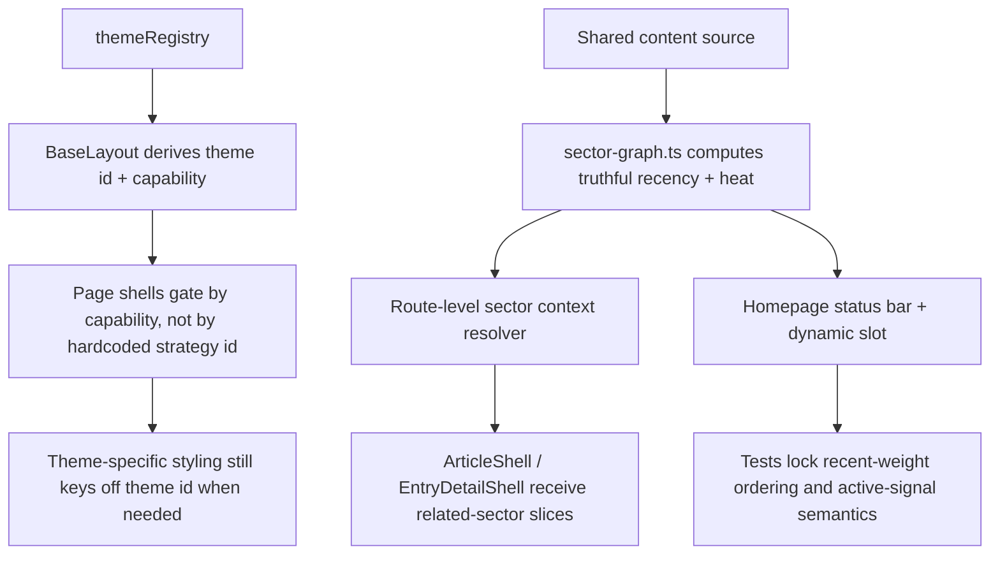

# refactor: Harden sector command architecture and signals

## Overview

这一轮不再继续追求更大的视觉翻新，而是把已经成型的策略主题体验补到“可信、可维护、可继续扩展”。当前首页、战区页和载体页已经明显更接近最初想要的“像游戏的内容资产指挥中心”，说明方向本身是对的；但最近 review 和实际使用体验也暴露出一个更现实的问题：体验层已经先跑到了前面，底层语义、主题架构和验证矩阵还没有完全跟上。下一阶段应优先修正热度信号、详情页数据边界、多主题能力模型与高价值回归测试，而不是再次重做视觉框架。

## Problem Frame

当前策略主题在使用体验上已经完成了关键转向：首页先看战区版图，点击节点先聚焦再读简报，进入 `/sectors/[slug]/` 后再切总览 / 资产部署 / 时间推进，博客、研究和实验也已经从“频道主角”降为“资产载体”。从用户体感上看，这已经比早期“档案库科技系统”更接近最初的设想（see origin: `docs/brainstorms/2026-04-15-strategy-interface-theme-requirements.md`）。

但当前 review 与实际体验共同指出，下一阶段的主要风险已经不在“还像不像游戏”，而在“这套游戏化表达是否可信且可持续”。主要缺口集中在四类：第一，动态补位和首页活跃信号仍有语义偏差，导致“热度真实”这条承诺没有完全落地；第二，detail route 仍直接依赖全量 sector graph，叶子页面和最重聚合层耦合过深；第三，主题注册表已经出现，但页面渲染和 CSS gating 仍是 `default/strategy` 二元硬编码，与“未来多主题治理”承诺不一致；第四，测试矩阵还没有覆盖最关键的回归路径，例如首页进入战区、未知主题回退、`lab.updatedAt` 非法值，以及未来 theme capability 行为（see related: `docs/brainstorms/2026-04-16-theme-maintenance-governance-requirements.md`）。

## Requirements Trace

- **Keep the current sector-command product direction** — Strategy R4-R10, R23-R31: 不推翻现有策略主题框架，不回退到频道优先或轻量换肤。
- **Make sector signals trustworthy** — Strategy R8, R14, R17, R19, R27, R30: 动态补位、活跃信号和首页状态文案必须真正反映近期活跃，而不是总量伪装成热度。
- **Make the multi-theme foundation real, not nominal** — Strategy R1-R3, Governance R4-R7, R12-R16: 主题 registry 不能只负责切换 id，还要真正支撑未来新增主题的壳层选择与治理规则。
- **Reduce coupling between leaf routes and the heaviest aggregation path** — Strategy R31-R32, Governance R5, R8-R11: detail page 应保持战区上下文，但不应再由展示壳层直接拉全量 graph。
- **Close the highest-value validation gaps** — Governance R4-R13: 把当前 review 暴露出的关键回归路径写进测试与治理清单。

## Scope Boundaries

- 不开启下一轮大规模视觉重做。
- 不新增第三主题的完整视觉设计或页面体系。
- 不改变当前“首页 -> 战区 -> 资产”的主导航结构。
- 不引入新的图形库、状态管理框架或服务端基础设施。
- 不把 detail page 的战区语义完全拿掉；本次只调整其数据边界和依赖关系。

## Context & Research

### Relevant Code and Patterns

- `src/lib/theme-sectors/sector-graph.ts` 已经是战区语义的唯一核心来源，但 `recentWeight` 已计算却未参与动态补位决策，说明“真实热度”模型尚未收口。
- `src/components/home/SectorCommandNetwork.astro` 现在承担首页战区主舞台，但状态条里仍将 `assetCount` 当成 `ACTIVE SIGNALS` 展示，文案和数据语义不一致。
- `src/lib/theme-sectors/get-sector-graph.ts` 已把 graph 获取集中化，但当前 cache contract 仍是“导出一个清缓存函数，但没有任何实际 invalidation 使用方”。
- `src/components/site/ArticleShell.astro`、`src/pages/research/[slug].astro`、`src/pages/lab/[slug].astro` 仍在 detail route 侧直接拉 sector graph，说明“集中入口”已建立，但“叶子页面解耦”还没完成。
- `src/lib/theme/theme-registry.ts` 已经引入 `capability` 字段，但 `src/layouts/BaseLayout.astro` 与 `src/styles/global.css` 仍主要沿用 `default-only` / `strategy-only` 与 `html[data-theme="strategy"]` 的二元结构。
- `src/pages/index.astro`、`src/pages/research/index.astro` 和 `src/components/home/HomeCommandViews.astro` 已证明“命令面板壳层”和“内容壳层”其实是两个不同页面层级，这为 capability-aware gating 提供了很清晰的切分点。
- `tests/e2e/theme.spec.ts`、`tests/e2e/sectors.spec.ts`、`tests/e2e/theme-governance.spec.ts` 和 `tests/unit/theme-sectors.test.ts` 已经是当前高价值回归面，可继续扩展而不需要重新发明测试框架。

### Institutional Learnings

- `docs/solutions/workflow-issues/hexo-to-astro-content-migration-workflow-2026-04-14.md` 强调要把共享内容事实与展示层解耦，并避免把多个 concern 混成隐式逻辑。这对本阶段尤其关键：detail page 的 sector context 应保留，但应该作为预先解析的切片进入展示层，而不是继续让壳层直接碰最重聚合逻辑。

### External References

- None. 当前代码库和最近两轮计划已经提供了足够明确的本地模式，因此这一阶段不需要额外外部研究，优先沿现有 Astro + Playwright + sector model 体系收口。

## Key Technical Decisions

- **Do not pivot away from the current strategy UX direction**: 现有使用体验已经证明“战区总控 + 战区详情 + 载体重释”方向成立，下一阶段重点应从“再设计”转为“补可信度和可维护性”。
- **Fix heat semantics before adding more ornament**: 动态补位与首页活跃信号是首页可信度的根；如果热度语义仍有偏差，再继续加交互只会放大伪态势感。
- **Treat multi-theme support as an architectural contract, not a documentation claim**: 如果 registry 允许新增 theme id，那么运行时壳层选择和 CSS gating 就必须跟上；否则应视为架构缺口，而不是未来再说的小优化。
- **Move sector context resolution upward, keep shells presentational**: detail route 仍应展示所属战区，但这类上下文应在 route 或共享解析层完成，再把切片传给 `ArticleShell` / `EntryDetailShell`。
- **Make cache freshness explicit**: 要么把 graph cache 定义成真正可失效的生命周期，要么去掉“看似支持失效其实没人调用”的半成品 contract。
- **Use tests to lock the next phase, not just docs**: 下一阶段最重要的不是再写更多治理文档，而是让关键行为有浏览器和单元覆盖，避免体验和架构再次脱节。

## Open Questions

### Resolved During Planning

- 当前是否需要再做一次大规模视觉重构：不需要。下一阶段优先修复架构与语义问题。
- “未来多主题”问题是否可以先靠文档弱化：不建议。既然 registry 和治理文档已经宣称可扩展，就应在运行时和页面壳层上补齐最小真实能力。
- detail page 是否应移除战区上下文：不应移除，但必须缩小其数据依赖边界。

### Deferred to Implementation

- capability-aware gating 的最终命名是 `data-theme-capability`、共享 helper，还是组件级 wrapper，可在实现时根据 Astro 模板结构定稿。
- graph freshness 最终应采用“构建期私有缓存”“请求级缓存”还是明确 invalidation hook，需结合 Astro 运行时与 preview 行为确定。
- 是否在这一阶段引入一个真正的第三主题作为验收样本，还是使用测试夹具验证 capability 行为，可在实现时按成本选择。

## High-Level Technical Design

> *This illustrates the intended approach and is directional guidance for review, not implementation specification. The implementing agent should treat it as context, not code to reproduce.*

## Alternative Approaches Considered

- **继续做更强的视觉或交互翻新**: 未选，因为当前主要矛盾已经不是“不够像游戏”，而是“像游戏但底层还不够可信”。
- **把 theme system 明确降级为永久双主题结构**: 未选，因为这会直接和治理文档、theme registry 以及未来新增主题的目标相冲突。
- **从 detail page 完全移除 sector context**: 未选，因为这会削弱载体页作为“战区资产表面”的叙事连续性。

## Implementation Units

- [x] **Unit 1: Correct sector hotness semantics on the homepage**

**Goal:** 让动态补位和首页状态条真正表达“近期活跃”，而不是把总量误写成热度。

**Requirements:** Strategy R8, R14, R17, R19, R27, R30

**Dependencies:** None

**Files:**
- Modify: `src/lib/theme-sectors/sector-graph.ts`
- Modify: `src/components/home/SectorCommandNetwork.astro`
- Modify: `tests/unit/theme-sectors.test.ts`
- Modify: `tests/e2e/sectors.spec.ts`

**Approach:**
- 调整 unmatched topic cluster 的排序逻辑：优先按 `recentWeight` 选择动态补位战区，再用总 `weight` 作为回退或 tie-breaker。
- 将首页 `ACTIVE SIGNALS` 的计算改成真正基于 `recentActivity`，或者同步调整文案使其诚实表达“总量”。
- 保持当前固定核心战区、外围散点和 lead assets 结构不变，只修正“热度信号如何被解释”。

**Patterns to follow:**
- `src/lib/theme-sectors/sector-graph.ts`
- `tests/unit/theme-sectors.test.ts`

**Test scenarios:**
- Happy path: 一个较新的 unmatched cluster 即使总资产更少，也会因为近期活跃度更高而获得动态补位位点。
- Happy path: 首页状态条的 active 指标只统计最近活跃信号，不会被旧资产和 undated 资产抬高。
- Edge case: 当两个 cluster 的 `recentWeight` 相同，系统仍能稳定地回退到总 `weight` 或既定次序。
- Edge case: undated `research` / `lab` 资产不会重新抬高动态补位判断和首页 active 指标。

**Verification:**
- 动态补位位点与首页状态条都能被解释为“近期活跃”，而不是“总量伪装成热度”。
- 新增的 unit / e2e 断言能锁住这一语义，不会在后续 UI 调整时回归。

- [x] **Unit 2: Decouple detail routes from full-graph lookups and define graph freshness**

**Goal:** 让 detail route 继续拥有战区上下文，但不再由展示壳层直接依赖最重的 graph 聚合入口，同时明确 graph cache 的真实生命周期。

**Requirements:** Strategy R29-R32; Governance R5, R8-R11

**Dependencies:** Unit 1

**Files:**
- Modify: `src/components/site/ArticleShell.astro`
- Modify: `src/components/site/EntryDetailShell.astro`
- Modify: `src/pages/[year]/[month]/[day]/[slug].astro`
- Modify: `src/pages/blog/[slug].astro`
- Modify: `src/pages/research/[slug].astro`
- Modify: `src/pages/lab/[slug].astro`
- Modify: `src/lib/theme-sectors/get-sector-graph.ts`
- Modify: `src/lib/theme-sectors/sector-presenters.ts`
- Modify: `tests/e2e/routes.spec.ts`
- Create: `tests/unit/sector-context.test.ts`

**Approach:**
- 将“根据当前 asset href 找所属战区”的责任上移到 route 或共享 context resolver，而不是继续放在 `ArticleShell` 这类展示壳层里。
- 让 shell 组件接收预解析好的 `relatedSectors` 或统一的 route context props，保持展示层更纯。
- 同时明确 `getSectorGraph()` 的 contract：要么去掉无人使用的 `clearSectorGraphCache()` 并把缓存定义成构建/请求内私有行为，要么补上真实 invalidation 路径；不要继续保留“看似可失效但实际上没人调用”的接口。

**Patterns to follow:**
- `src/pages/research/[slug].astro`
- `src/pages/lab/[slug].astro`
- `src/components/site/EntryDetailShell.astro`

**Test scenarios:**
- Happy path: legacy blog detail、native blog detail、research detail、lab detail 都仍能展示正确的所属战区 chips。
- Happy path: 展示壳层组件不再直接调用 `getSectorGraph()`，而是消费外部传入的 sector context。
- Edge case: preview 或长生命周期环境下，graph freshness contract 不再依赖一个无人调用的清缓存函数。
- Integration: 从首页进入战区，再进入 detail page，战区上下文仍然连续可见。

**Verification:**
- detail shell 与 full graph 的耦合关系被切断，叶子页面更容易独立演进。
- graph freshness contract 在代码层是显式的，不再存在“缓存看起来支持失效但实际上没人用”的隐患。

- [x] **Unit 3: Replace binary theme gating with capability-aware shell selection**

**Goal:** 让 theme registry 的 `capability` 成为真正的运行时与页面壳层契约，而不是只在数据结构里存在。

**Requirements:** Strategy R1-R3; Governance R4-R7, R12-R16

**Dependencies:** None

**Files:**
- Modify: `src/lib/theme/theme-registry.ts`
- Modify: `src/layouts/BaseLayout.astro`
- Modify: `src/components/site/Header.astro`
- Modify: `src/styles/global.css`
- Modify: `src/pages/index.astro`
- Modify: `src/pages/research/index.astro`
- Modify: `src/components/home/HomeCommandViews.astro`
- Modify: `src/components/research/ResearchModeSwitcher.astro`
- Modify: `tests/e2e/theme.spec.ts`
- Create: `tests/unit/theme-registry.test.ts`

**Approach:**
- 让 `BaseLayout` 在根节点同时暴露 theme id 与 theme capability，使页面壳层选择和视觉样式解耦。
- 用 capability-aware gating 替换当前 `.default-only` / `.strategy-only` 二元结构，让“内容壳层”和“命令壳层”成为更真实的基础能力。
- 保留 strategy 当前按 theme id 落地的视觉样式，但让壳层显隐不再依赖 `theme.id !== defaultTheme` 这类二元判断。
- 不要求本单元交付第三主题的完整实现，但要让“新增一个同 capability 的新 theme”不再自动退回错误壳层。

**Patterns to follow:**
- `src/lib/theme/theme-registry.ts`
- `src/layouts/BaseLayout.astro`
- `src/pages/index.astro`

**Test scenarios:**
- Happy path: `content` capability 主题始终显示内容壳层，`command` capability 主题始终显示命令壳层。
- Happy path: strategy 主题继续保留当前战区总控首页与研究策略视图，不回归。
- Edge case: 本地存储中存在未知 theme id 时，仍安全回退到默认主题与内容壳层。
- Edge case: registry 中新增一个非默认 theme id 时，不会因为二元 gating 而错误展示默认壳层。

**Verification:**
- registry 的 capability 字段真正参与运行时行为。
- 后续新增主题时，页面壳层选择不再需要大范围复制 `default/strategy` 二元判断。

- [x] **Unit 4: Expand the regression matrix around critical strategy-theme flows**

**Goal:** 把这轮 review 暴露出来的高价值回归路径补进测试和治理清单，避免下一轮又靠人工观察兜底。

**Requirements:** Governance R4-R13

**Dependencies:** Unit 1, Unit 2, Unit 3

**Files:**
- Modify: `tests/e2e/theme.spec.ts`
- Modify: `tests/e2e/sectors.spec.ts`
- Modify: `tests/unit/content/content-schema.test.ts`
- Modify: `tests/unit/theme-sectors.test.ts`
- Modify: `docs/theme-maintenance.md`
- Modify: `docs/checklists/theme-code-change-checklist.md`
- Modify: `docs/checklists/theme-content-update-checklist.md`

**Approach:**
- 为首页“选择战区 -> 点击进入战区 -> 到达正确 `/sectors/[slug]/`”补齐完整点击链路断言。
- 为未知或陈旧 theme id 的 localStorage 回退补齐浏览器验证。
- 为 `lab.updatedAt` 非法值补齐 schema 负向测试，并把动态补位与 capability-aware gating 的关键行为写进单元或浏览器断言。
- 同步更新治理文档，把“新增主题必须补 capability 行为验证”“战区热度语义变化要补相关测试”写成明确检查项。

**Patterns to follow:**
- `tests/e2e/theme.spec.ts`
- `tests/unit/content/content-schema.test.ts`
- `docs/theme-maintenance.md`

**Test scenarios:**
- Happy path: 首页在 strategy 主题下选择 `AI 工具侦察` 后，点击 CTA 能进入 `/sectors/ai-tools-intel/` 并看到正确战区标题。
- Happy path: localStorage 中有未知 theme id 时，页面回退到默认主题且不泄漏命令壳层。
- Happy path: `labEntrySchema` 对非法 `updatedAt` 给出失败结果。
- Integration: 动态补位与 capability-aware gating 的核心行为至少有一条自动化断言，不再只靠人工记忆。

**Verification:**
- 当前 review 中最关键的测试缺口被显式覆盖。
- 治理文档与自动化断言之间建立对应关系，而不是文档说一套、测试查不到。

## System-Wide Impact

- **Readers / visitors:** 主页热度与战区状态会更可信，首页进入战区的主链路更稳。
- **Maintainer workflow:** 多主题治理会从“文档声明”升级为“架构 + 测试共同约束”，降低未来新增主题时的隐性返工。
- **Future themes:** 这一阶段不会交付第三主题，但会决定第三主题到底是“真实可扩展”还是“继续名义可扩展、实际上仍二元”。

## Risks & Mitigation

| Risk | Mitigation |
|------|------------|
| capability-aware gating 重构时打破当前 default / strategy 页面稳定性 | 保持 theme id 用于样式，先把 capability 限定在壳层选择；用现有 e2e 矩阵兜住回归 |
| 修正动态补位后，首页中心战区分布明显变化，引发“观感突然不同” | 先用 unit 断言固定语义，再用状态文案解释“近期活跃”而不是仅靠视觉猜测 |
| detail route 解耦时把 sector chips 丢失或让不同 detail route 逻辑分叉 | 统一通过 route-level resolver 或共享 context helper 下发，避免三个 detail route 各自发明一套 |
| cache freshness contract 定义不清，导致实现时继续半缓存半失效 | 在该阶段明确选择一种 contract，并移除与之矛盾的接口或假设 |

## Documentation / Operational Notes

- 这份计划是当前策略主题的“第二阶段”计划：不推翻体验方向，只修补 review 和使用体验已经证明需要收口的地方。
- 完成后，`docs/theme-maintenance.md` 应反映新的 capability-aware 主题治理方式，而不再默认把“多主题”理解成“只有 default/strategy 两个硬编码模式”。

## Sources & References

- Origin requirements: `docs/brainstorms/2026-04-15-strategy-interface-theme-requirements.md`
- Governance requirements: `docs/brainstorms/2026-04-16-theme-maintenance-governance-requirements.md`
- Previous implementation plan: `docs/plans/2026-04-16-001-feat-sector-command-theme-governance-plan.md`
- Previous follow-up fix plan: `docs/plans/2026-04-16-002-fix-sector-signals-and-graph-loading-plan.md`
- Institutional learning: `docs/solutions/workflow-issues/hexo-to-astro-content-migration-workflow-2026-04-14.md`
