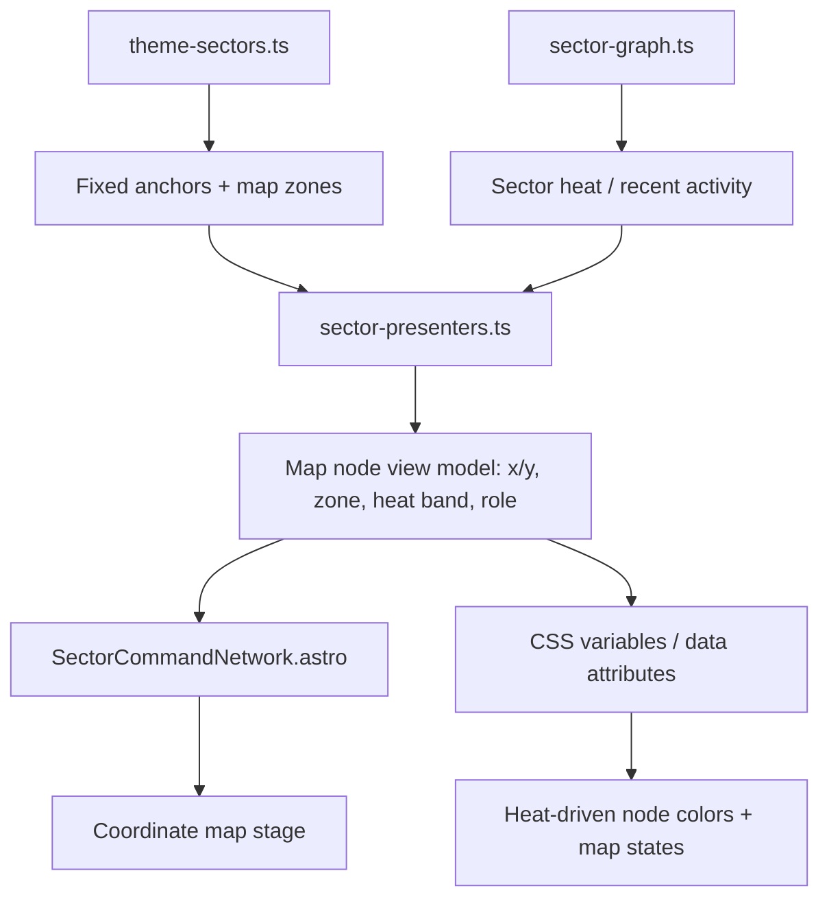

# feat: Recast sector network as coordinate map UI

## Overview

将当前首页策略主题中的战区版图从“抽象沙盘式节点布局”升级为真正的地图式战区界面。新的首页主舞台需要让不同战区拥有稳定、可感知的坐标位置，并通过节点颜色直接表达热度，让用户进入首页时首先感知到的是一张正在升温或降温的战区地图，而不是一组带有地图语气的卡片。这个变化属于策略主题的体验强化，而不是方向转向：它延续现有“首页先看战区 -> 再进战区 -> 再看资产”的结构，只重做首页主舞台的表达方式。

## Problem Frame

当前策略主题已经完成了首页战区总控、`/sectors/[slug]/` 战区页、以及 blog / research / lab 作为资产载体的重构，整体已经比“档案库科技系统”更接近用户想要的策略游戏指挥界面（see related: `docs/plans/2026-04-16-001-feat-sector-command-theme-governance-plan.md`; see related: `docs/plans/2026-04-16-003-refactor-sector-command-hardening-plan.md`）。但首页当前的战区主舞台仍更像一个构图精致的抽象沙盘，而不是“真正的地图式战区版图”。用户最新补充的要求非常明确：战区应该像地图上的不同坐标点一样存在，且节点颜色要和热度直接相关（see origin: `docs/brainstorms/2026-04-15-strategy-interface-theme-requirements.md`).

这意味着首页当前 `SectorCommandNetwork` 的结构虽然已经解决了“拥挤”和“路线混乱”，但还没有满足新的地图化要求。下一步不是简单调整几条 CSS，而是明确首页地图使用何种坐标模型、固定战区与动态战区怎样共享空间记忆、热度如何映射成稳定的视觉语言，以及这些变化怎样保持可维护和可测试。

## Requirements Trace

- **Strategy homepage remains sector-first** — Strategy R7-R11, R23-R25: 首页仍以战区为主角，点击节点仍先进入聚焦与情报面板，不回退到频道首页。
- **True map-style battlefield expression** — Strategy R33-R36: 首页战区图需要是真正地图式布局；战区具备明确坐标；节点颜色映射热度；固定核心战区保持稳定坐标，动态战区只在预设区域内变化。
- **Heat remains truthful, not decorative** — Strategy R8, R14, R17, R19, R27, R30: 颜色和地图表现必须继续服从真实热度语义，而不是再次引入纯装饰性视觉。
- **Governance and multi-theme integrity remain intact** — Governance R4-R7, R12-R16: 地图化改造不能破坏 default/content shell，也不能让 strategy 主题失去现有测试和治理基础。

## Scope Boundaries

- 不重做战区页 `/sectors/[slug]/` 的结构。
- 不改写当前固定核心战区名称、角色和热度来源规则。
- 不引入真实地理地图、GIS、瓦片地图或第三方绘图库。
- 不把首页改成自由拖拽、缩放、可平移的大型地图应用。
- 不在本轮引入第三主题的完整视觉体系。

## Context & Research

### Relevant Code and Patterns

- `src/components/home/SectorCommandNetwork.astro` 当前已经承担首页主舞台，包含固定核心战区、动态补位、外围散点、状态条和聚焦触发器，是这次地图化改造的主入口。
- `src/styles/global.css` 中 `sector-network__stage`、`sector-network__arena`、`sector-region`、`sector-route` 已形成当前沙盘式结构，但布局仍以视觉编排为主，而不是显式坐标模型。
- `src/data/theme-sectors.ts` 当前只定义战区语义、角色和 topicAliases，还没有地图锚点或空间布局元数据。
- `src/lib/theme-sectors/sector-presenters.ts` 已承担从 graph 派生首页布局与标签表达的职责，是最自然的地图坐标与热度视觉元数据派生层。
- `src/lib/theme-sectors/sector-graph.ts` 已经修正了动态补位与热度语义，因此地图颜色可以直接建立在现有 `recentActivity` / `heat` / `role` 上，而不需要另起一套热度系统。
- `tests/e2e/theme.spec.ts` 当前已覆盖首页策略主题主链路，是这次地图化首页的主要浏览器回归面。
- `tests/unit/theme-sectors.test.ts` 已覆盖核心战区与动态补位逻辑，适合作为地图布局派生单测的基础。

### Institutional Learnings

- `docs/solutions/workflow-issues/hexo-to-astro-content-migration-workflow-2026-04-14.md` 强调共享内容事实与展示层要分开建模。这次地图化也应遵守同一原则：坐标、区域和颜色映射属于 theme-sector presentation 层，不应混入内容 schema 或文章事实。

### External References

- None. 当前代码库已经有成熟的 Astro 组件、CSS 驱动交互和战区模型，不需要为这次地图化改造引入额外外部技术依赖。

## Key Technical Decisions

- **Interpret “map” as an abstract tactical theater map, not a real geographic map**: 这样既符合当前策略主题语义，也避免引入与产品目标不匹配的地理数据和图形库复杂度。
- **Represent fixed sectors with stable, hand-authored anchors**: 三个固定核心战区需要拥有明确且稳定的相对坐标，作为用户长期空间记忆的锚点。
- **Place dynamic and peripheral sectors inside designated zones, not arbitrary free positions**: 动态补位与外围散点可以变化，但只能在预设区域内变化，避免首页每次刷新都丧失地图记忆。
- **Drive node color from derived heat bands, not ad hoc per-component styling**: 热度颜色应由 presenter 层统一派生为 `cool / warm / hot` 或类似 band，再由 CSS 系统消费。
- **Keep interaction semantics unchanged while changing the spatial language**: 地图化改造应强化“选中战区 -> 读取情报”的节奏，而不是引入新的导航分支。

## Open Questions

### Resolved During Planning

- “真正地图样式”是否意味着真实地理地图：否，本次按抽象战术地图处理。
- 固定核心战区坐标是否应随热度漂移：否，固定核心战区坐标保持稳定。
- 动态补位和外围散点是否完全自由定位：否，它们只能在预设区域内补位。

### Deferred to Implementation

- 热度颜色最终采用三段还是四段色阶，可在实现时结合现有 `getSectorHeatLabel()` 与视觉观感定稿。
- 地图节点更适合区域徽章、标记针点，还是小型战区牌块，可在实现时通过一轮视觉试装定稿。
- 外围散点在移动端是否继续保留地图坐标感，还是降级为列表化边栏，可在响应式实现时确定。

## High-Level Technical Design

> *This illustrates the intended approach and is directional guidance for review, not implementation specification. The implementing agent should treat it as context, not code to reproduce.*

## Alternative Approaches Considered

- **继续沿用当前抽象沙盘，只做更多装饰纹理**: 未选，因为这无法满足“不同战区是地图上的不同坐标”这个新要求。
- **使用真实地理地图或外部可视化库**: 未选，因为这会引入与当前产品语义不匹配的复杂度，也会破坏当前 Astro/CSS 轻量实现路线。
- **完全随机生成动态与外围战区位置**: 未选，因为这会破坏用户的空间记忆，与 R36 冲突。

## Implementation Units

- [x] **Unit 1: Add map-anchor and heat-band presentation metadata**

**Goal:** 为首页战区地图建立稳定坐标和热度视觉元数据来源。

**Requirements:** Strategy R33-R36, R14, R17, R19

**Dependencies:** None

**Files:**
- Modify: `src/data/theme-sectors.ts`
- Modify: `src/lib/theme-sectors/sector-presenters.ts`
- Modify: `tests/unit/theme-sectors.test.ts`
- Create: `tests/unit/sector-map-layout.test.ts`

**Approach:**
- 为固定核心战区定义手写锚点或地图区域元数据，例如中心区、左翼、右翼。
- 为动态补位战区和外围散点定义预设补位区，而不是直接在组件里硬编码位置。
- 在 presenter 层派生首页地图所需 view model，包括：相对坐标、所在区域、节点尺寸级别、热度 band、颜色 token key。
- 保持 graph 仍然只负责内容与热度语义，不让地图坐标污染底层内容聚合层。

**Patterns to follow:**
- `src/data/theme-sectors.ts`
- `src/lib/theme-sectors/sector-presenters.ts`
- `tests/unit/theme-sectors.test.ts`

**Test scenarios:**
- Happy path: 三个固定核心战区始终拿到稳定且不同的坐标锚点。
- Happy path: 动态补位战区只会落入预设的动态区域，而不会覆盖固定核心战区坐标。
- Edge case: 没有外围散点时，地图 view model 仍然完整生成。
- Edge case: 不同热度区间会得到稳定的 heat band，而不是由组件现场推断。

**Verification:**
- 首页地图所需的空间与颜色元数据都有单一派生入口。
- 坐标模型和热度 band 可以在不改组件结构的前提下被复用和测试。

- [x] **Unit 2: Rebuild the homepage sector board as a coordinate-based map stage**

**Goal:** 将首页战区主舞台改造成真正的坐标地图式布局。

**Requirements:** Strategy R7-R11, R23-R25, R33-R36

**Dependencies:** Unit 1

**Files:**
- Modify: `src/components/home/SectorCommandNetwork.astro`
- Modify: `src/components/home/HomeCommandViews.astro`
- Modify: `tests/e2e/theme.spec.ts`

**Approach:**
- 让 `SectorCommandNetwork` 直接消费地图 view model，而不是继续在组件内部假定主区、侧翼和底部卡片构图。
- 将核心节点改成基于坐标定位的地图节点，并让连线、补位区、外围散点都建立在地图区域关系之上。
- 保持现有聚焦模式、inspector 联动和“进入战区”动作不变，只替换首页主舞台的空间表达。
- 若需要，为地图节点增加更贴近地图语义的结构标识，例如 region label、coordinate marker 或 control overlay。

**Patterns to follow:**
- `src/components/home/SectorCommandNetwork.astro`
- `src/components/home/HomeCommandViews.astro`
- `tests/e2e/theme.spec.ts`

**Test scenarios:**
- Happy path: strategy 首页仍默认聚焦主战区，并能从地图节点进入 inspector。
- Happy path: 固定核心战区在地图上呈现稳定方位关系，而不是均质平铺。
- Integration: 点击地图节点后，inspector 内容与 `进入战区` 路由仍保持正确。
- Edge case: 动态补位战区存在时，不会覆盖固定战区的位置或破坏点击可达性。

**Verification:**
- 首页主舞台会被感知为地图式战区版图，而不是抽象节点板。
- 首页主链路不回归，依然是“选战区 -> 看简报 -> 进战区”。

- [x] **Unit 3: Build a heat-driven map visual system with responsive fallback**

**Goal:** 用颜色、底图和状态变化把地图热度表达做实，同时保证移动端仍可读。

**Requirements:** Strategy R14, R31-R32, R33-R36

**Dependencies:** Unit 1, Unit 2

**Files:**
- Modify: `src/styles/global.css`
- Modify: `tests/e2e/theme.spec.ts`
- Modify: `tests/e2e/sectors.spec.ts`

**Approach:**
- 为地图节点引入 heat-band 驱动的颜色系统，例如冷区、温区、热区不同主色与边缘辉光。
- 将当前舞台背景从抽象网格进一步转向地图语义，例如地形纹理、方位线、区域轮廓或战区边界，但仍保持 CSS 驱动。
- 保留 focus / selected 状态，使热度颜色和选中状态能够共存而不互相覆盖。
- 设计移动端降级方案：桌面端保持地图感，窄屏下允许转成更线性的区域堆叠，但仍保留方位和热度表达。

**Patterns to follow:**
- `src/styles/global.css`
- 现有 `sector-network__stage` / `sector-region` / `sector-route` 体系

**Test scenarios:**
- Happy path: strategy 首页地图节点会根据热度拥有不同视觉类别，而不只是统一颜色。
- Happy path: 选中节点后仍能保持清晰可读，不会因为热度色覆盖而丢失 focus 状态。
- Edge case: 移动端断点下地图降级后仍能区分核心战区、动态补位和热度差异。
- Integration: 热度变化会同步反映到地图颜色层，而无需修改组件模板结构。

**Verification:**
- 颜色已经成为地图热度的一部分，而不是附着在节点外的附加说明。
- 地图化视觉不会破坏文本可读性与点击可用性。

- [x] **Unit 4: Update validation and maintenance guidance for map-based sectors**

**Goal:** 把地图式坐标布局和热度配色纳入测试与维护规范，避免后续改动把地图重新退化成示意图。

**Requirements:** Governance R4-R13; Strategy R33-R36

**Dependencies:** Unit 1, Unit 2, Unit 3

**Files:**
- Modify: `docs/theme-maintenance.md`
- Modify: `docs/checklists/theme-code-change-checklist.md`
- Modify: `docs/checklists/theme-content-update-checklist.md`
- Modify: `tests/e2e/theme.spec.ts`
- Modify: `tests/unit/theme-sectors.test.ts`
- Modify: `tests/unit/sector-map-layout.test.ts`

**Approach:**
- 将“固定核心战区坐标稳定”“热度颜色映射正确”“动态补位只在预设区域内移动”写进维护规则和检查清单。
- 为首页地图化表达增加最小自动化保护，例如检查主战区节点存在稳定数据属性、地图舞台存在热度 band 标记、点击链路未回归。
- 让未来对地图坐标和热度样式的改动有明确的验收标准，而不是重新回到纯观感判断。

**Patterns to follow:**
- `docs/theme-maintenance.md`
- `docs/checklists/theme-code-change-checklist.md`
- `tests/e2e/theme.spec.ts`

**Test scenarios:**
- Happy path: 首页 strategy 地图存在稳定的地图节点标识与热度 band 标识。
- Happy path: 固定主战区坐标或区域标识在回归测试中保持稳定。
- Edge case: 动态战区存在与不存在时，地图结构都能通过断言而不脆弱。
- Integration: 维护清单明确要求地图坐标和热度颜色变更必须做浏览器验证。

**Verification:**
- 地图化首页的关键契约被自动化测试和治理文档共同锁住。
- 后续地图改动不会再次退化成“看起来像地图，但没有真正坐标与热度语义”的状态。

## System-Wide Impact

- **Homepage interaction graph:** 首页主舞台会从“沙盘式布局”升级为“坐标地图式布局”，但聚焦、inspector 和进入战区的主链路保持不变。
- **Presentation architecture:** 战区坐标和热度颜色会成为 presenter 层的一部分，强化“内容语义”和“视觉表达”分层。
- **Maintenance load:** 固定核心战区的坐标将成为新的长期设计契约，后续新增或调整战区时需要同步维护坐标与补位区。
- **Testing surface:** 首页 strategy 主题会新增地图坐标与热度颜色相关的浏览器与单测保护面。

## Risks & Mitigation

| Risk | Mitigation |
|------|------------|
| 地图化改造后节点重叠、点击区域混乱 | 先把坐标模型抽到 presenter 层，再在组件和 CSS 层控制碰撞与区域边界 |
| 热度颜色过强，影响文本可读性 | 使用 heat band + 独立 focus 层，不把颜色直接铺满文本层 |
| 动态补位战区破坏固定战区的空间记忆 | 动态战区只允许进入预设补位区，不与固定锚点共享坐标 |
| 移动端地图感过强导致信息不可读 | 在断点下允许转成线性区域堆叠，但保留方位与热度表达 |

## Documentation / Operational Notes

- 这份计划是策略主题体验的继续深化，而不是方向推翻。
- 实现完成后，应将地图坐标与热度颜色纳入长期维护规则，避免未来“只改 CSS”时不小心打散用户空间记忆。

## Sources & References

- Origin document: `docs/brainstorms/2026-04-15-strategy-interface-theme-requirements.md`
- Related plan: `docs/plans/2026-04-16-001-feat-sector-command-theme-governance-plan.md`
- Related plan: `docs/plans/2026-04-16-003-refactor-sector-command-hardening-plan.md`
- Related governance document: `docs/brainstorms/2026-04-16-theme-maintenance-governance-requirements.md`
- Institutional learning: `docs/solutions/workflow-issues/hexo-to-astro-content-migration-workflow-2026-04-14.md`
